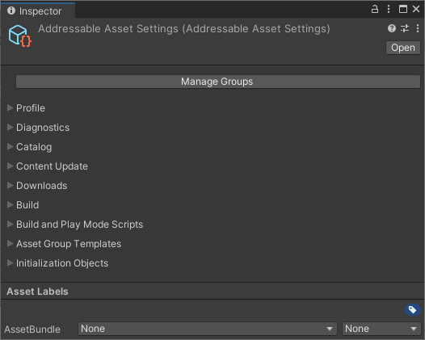
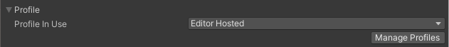
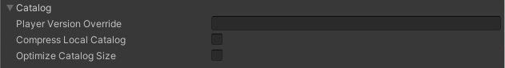
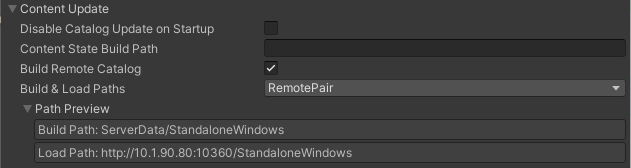
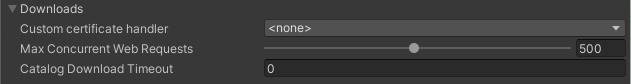
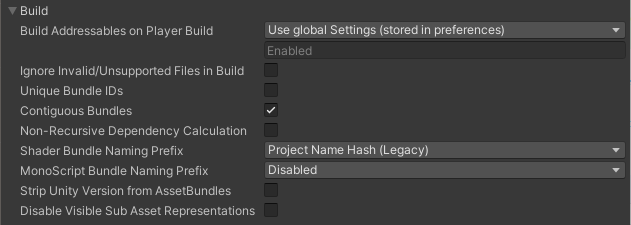
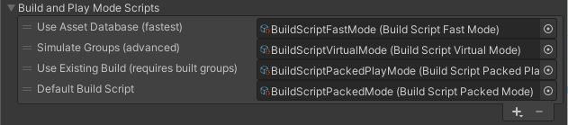
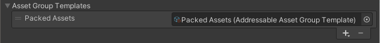
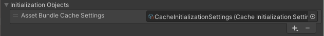

# Addressable Asset Settings

You can access the main Addressable system option on the __Addressable Asset Settings__ Inspector (menu: __Window > Asset Management > Addressables > Settings__). 

The Addressables system stores the settings asset in the AddressableSettingsData folder (under your Project Assets folder). If this folder doesn't exist yet, you must initialize the Addressables system from the __Groups__ window  (menu: __Window > Asset Management > Addressables > Groups__). 

*The Addressable Asset Settings Inspector*

The Inspector contains the following sections:

* [Profile](#profile)
* [Diagnostics]
* [Catalog]
* [Content Update]
* [Downloads]
* [Build]
* [Build and Play Mode Scripts]
* [Asset Group Templates]
* [Initialization object list]

You can click the __Manage Groups__ button to open the [Groups window].

## Profile

 *Profile settings*

Use the __Profile in Use__ list to choose the active profile. The active profile determines the value of variables used by the Addressables build scripts. 

Click the __Manage Profiles__ button to open the __Profiles__ window where you can create new profiles and change profile variables.

See [Profiles] for more information about profiles.

## Diagnostics

 *Diagnostics settings*

| Property| Function |
|:---|:---|
| __Send Profiler Events__| Enables profiler events. You must enable this setting to use the Addressables [Event Viewer] window. |
| __Log Runtime Exceptions__| Logs runtime exceptions for asset loading operations (in addition to recording the error to the [AsyncOperationHandle.OperationException] property). |

> [!TIP]
> By default, Addressable Assets only logs warnings and errors. You can enable detailed logging by opening the **Player** settings window (menu: **Edit** > **Project Settings...** > **Player**), navigating to the **Other Settings** > **Configuration** section, and adding "`ADDRESSABLES_LOG_ALL`" to the **Scripting Define Symbols** field.

## Catalog

 *Catalog settings*

Settings related to the Addressables Catalog, which maps the address of an asset to its physical location.

| Property| Function |
|:---|:---|
| __Player Version Override__| Overrides the timestamp used to formulate the remote catalog name. If set, the remote catalog is named, `Catalog_<Player Version Override>.json`. If left blank, then the timestamp is used. Note that when you use a unique remote catalog name for every new build, you can host multiple versions of your content at the same base URL. If you use the same override string for every build, then all players will load the new catalog. Note also that player update builds always use the same remote catalog name as the build they are updating (see [Content update builds]). |
| __Compress Local Catalog__| Builds the catalog in a compressed AssetBundle file. Reduces the storage size of the catalog, but increases the time to build and to load the catalog. |
| _Optimize Catalog Size_| Reduces the size of the catalog by creating a lookup table for internal IDs. Can increase the time required to load the catalog. |

## Content Update

 *Content update settings*

Settings that control remote content builds and updates.

| Property| Function |
|:---|:---|
| __Disable Catalog Update on Startup__| Disables the automatic check for an updated remote catalog when the Addressables system initializes at runtime. You can manually [check for an updated catalog]. |
| __Content State Build Path__|Where to build the content state file produced by the default build script.|
| __Build Remote Catalog__| Enable to build a remote catalog. |
| __Build & Load Paths__ | Where to build and load the remote catalog. Choose a [Profile] path pair from the list or select `<custom>` if you want to set the build and load paths separately. Only visible when you enable **Build Remote Catalog**.|
| __Build Path__| Where to build the remote catalog. Typically, you should use the _RemoteBuildPath_ [Profile] variable.  Only shown if you set __Build & Load Paths__ to `<custom>`.|
| __Load Path__| The URL at which to access the remote catalog. Typically, you should use the _RemoteLoadPath_ [Profile] variable.  Only shown if you set __Build & Load Paths__ to `<custom>`.|

## Downloads

 *Download settings*

Settings that affect catalog and AssetBundle download handling.

| Property| Function |
|:---|:---|
| __Custom certificate handler__| The class to use for custom certificate handling. The list contains all classes in the project that extend [UnityEngine.Networking.CertificateHandler]. |
| __Max Concurrent Web Requests__| The system queues any requests beyond this limit. |
| __Catalog Download Timeout__ | How many seconds to wait for a catalog file to download. |

## Build

 *Build settings*

Settings that affect all builds.

| Property| Function |
|:---|:---|
| **Build Addressables on Player Build** | Whether Unity builds Addressables content as part of your Player build. &#8226; __Build Addressables content on Player Build__: Always build Addressables content when building the Player. &#8226; __Do not Build Addressables content on Player Build__: Never build Addressables content when building the Player. (If you modify Addressables content, you must rebuild it manually before building the Player.) &#8226; __Use global Settings (stored in preferences)__: Use the value specified in the [Unity Editor Preferences] \(under __Addressables__).  The first two options override the global Preference for the current Project and affect all contributors who build the Project. Otherwise, the global, Preferences value applies to all Unity projects. See [Building content] for more information. |
| __Ignore Invalid/Unsupported Files in Build__| If enabled, the Addressables build script excludes invalid or unsupported files rather than aborting the build. |
| __Unique Bundle IDs__| Whether to produce a unique name for a bundle in every build. See [Unique Bundle IDs] for more information. |
| __Contiguous Bundles__| Produces a more efficient bundle layout. If you have bundles produced by Addressables 1.12.1 or earlier, disable this option to minimize bundle changes. |
| __Non-Recursive Dependency Calculation__ | Enable this option to improve build times and reduce runtime memory overhead when assets have circular dependencies. Examples: &#8226; A prefab assigned to Bundle A references a material assigned to Bundle B. If this option is disabled, Unity needs to calculate the material's dependencies twice, once for each bundle. If this option is enabled, Unity only needs to calculate the material's dependencies once, for Bundle B. &#8226; Many scenes reference the same material. If this option is disabled, Unity opens each scene to calculate shader usage, which is a costly operation. If this option is enabled, Unity only loads the material and doesn't need to open any scenes for dependency calculation.  This option is enabled by default when using Unity version 2021.2 or later. Disabling this option invalidates previously built bundles because the rebuilt bundles will have a different build layout. Therefore this option should remain enabled unless builds have been shipped.  Some circular dependencies can fail to load when the option is enabled because the referenced asset is always assigned to the same bundle location, even when more content is added to the build. This issue often occurs for Monoscripts. Building the MonoScript bundle (see **MonoScript Bundle Naming Prefix**) can help resolve these load failures. |
| __Shader Bundle Naming Prefix__ | How to name the bundle produced for Unity shaders. |
| __MonoScript Bundle Naming Prefix__ | How to name the bundle containing all MonoScripts. The bundle ensures that Unity loads all Monoscripts before any MonoBehaviors can reference them. It also decreases the number of duplicated or complex Monoscript dependencies and so, reduces runtime memory overhead. |
| __Strip Unity Version From AssetBundles__ | Whether to remove the Unity version from the bundle header. |
| __Disable Visible Sub Asset Representations__ | Enable this option to improve build times if you do not use subobjects directly (Sprites, sub-meshes, etc). |

## Build and Play Mode Scripts

 *Configured build and Play mode scripts*

Configures the [IDataBuilder] scripts available in the project. If you create a custom Build or Play Mode script, you must add it to this list before you can use it.

The Addressables packages contains a few build scripts that handle the default build processes and provide different ways to access your data in Play mode. You can find these scripts in the AddressableAssetData/DataBuilders folder.

To add a custom script, click the __+__ button and locate your script in the project. The custom script must extend [BuildScriptBase] or implement [IDataBuilder].

> [!NOTE]
> Build scripts and Play Mode scripts both implement __[IDataBuilder]__. The system distinguishes between them by the data type of the result they produce. A build script produces an __[AddressablesPlayerBuildResult]__, while a Play Mode script produces an __[AddressablesPlayModeBuildResult]__. In a custom script, implement the __[CanBuildData]__ method.

## Asset Group Templates

 *Configured group templates*

Defines the list of templates that you can use to create new groups. When you create a new template, you must add it to this list before you can use it.

The Addressables package contains one template that includes the schemas used by the default build scripts. You can find the template in the AddressableAssetData/AssetGroupTemplates folder. 

To add a custom template, click the __+__ button and locate your custom template asset in your project.

See [Group templates] for information on creating custom templates.

## Initialization object list

 *Configured InitializationObjects*

Configures the initialization objects for the project. Initialization objects are ScriptableObject classes that implement the [IObjectInitializationDataProvider] interface. You can create these objects to pass data to the Addressables initialization process at runtime. 

To add an initialization object, click the __+__ button and locate your initialization object asset in the project.

See [Customizing initialization] for more information.

[Diagnostics]: #diagnostics
[Content Update]: #content-update
[Customizing initialization]: xref:addressables-api-initialize-async
[Downloads]: #downloads
[Build]: #build
[AddressablesPlayerBuildResult]: xref:UnityEditor.AddressableAssets.Build.AddressablesPlayerBuildResult
[Asset Group Templates]: #asset-group-templates
[Build and Play Mode Scripts]: #build-and-play-mode-scripts
[Catalog]: #catalog
[check for an updated catalog]: xref:addressables-api-load-content-catalog-async#updating-catalogs
[IDataBuilder]: xref:UnityEditor.AddressableAssets.Build.IDataBuilder
[BuildScriptBase]: xref:UnityEditor.AddressableAssets.Build.DataBuilders.BuildScriptBase
[Event Viewer]: xref:addressables-event-viewer
[General]: #general
[Group templates]: xref:addressables-group-settings#group-templates
[Groups window]: xref:addressables-groups#groups-window
[Groups]: xref:addressables-groups
[Initialization object list]: #initialization-object-list
[Initialization objects list]: #initialization-object-list
[Initialization objects]: #initialization-object-list
[IObjectInitializationDataProvider]: xref:UnityEngine.ResourceManagement.Util.IObjectInitializationDataProvider
[Profile]: xref:addressables-profiles
[Profiles]: xref:addressables-profiles
[Unique Bundle IDs]: xref:addressables-content-update-builds#unique-bundle-ids-setting
[UnityEngine.Networking.CertificateHandler]: xref:UnityEngine.Networking.CertificateHandler
[AddressablesPlayModeBuildResult]: xref:UnityEditor.AddressableAssets.Build.AddressablesPlayModeBuildResult
[CanBuildData]: xref:UnityEditor.AddressableAssets.Build.IDataBuilder.CanBuildData*
[AsyncOperationHandle.OperationException]: xref:UnityEngine.ResourceManagement.AsyncOperations.AsyncOperationHandle.OperationException
[Content update builds]: xref:addressables-content-update-builds
[Unity Editor Preferences]: xref:addressables-configuration#unity-preferences
[Building content]: xref:addressables-builds#build-with-player
