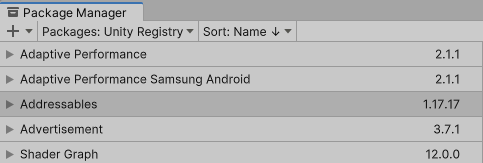
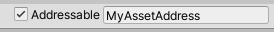
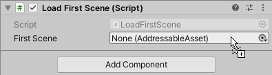
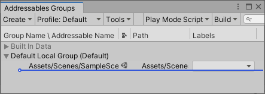
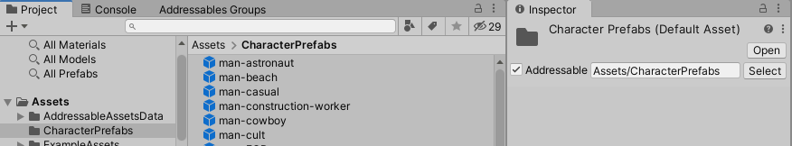
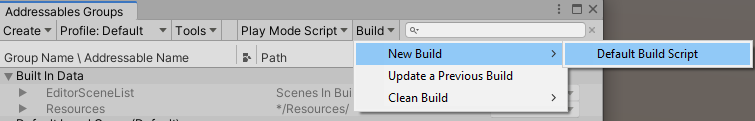

# Getting started

Once you have [installed the Addressables package] in your Unity Project, you can get started.

The basic steps to using Addressables include:

* Make your assets Addressable
* Reference and load those assets in code using the Addressables API
* Build your Addressable assets

See the [Space Shooter project] in the [Addressables-Sample] repository for an example of a project set up to use Addressable assets.

> [!NOTE]
> This Getting Started topic doesn't discuss the various ways you can organize your Addressable content. For information on that topic, see [Organizing Addressable Assets].  

## Installation

To install the Addressables package in your project, use the Unity Package Manager:

1. Open the Package Manager (menu: __Window > Package Manager__).
2. Set the package list to display packages from the __Unity Registry__.
   <br/><br/>
3. Select the Addressables package in the list.
4. Click __Install__ (at the bottom, right-hand side of the Package Manager window).

To set up the Addressables system in your Project after installation, open the __Addressables Groups__ window and click __Create Addressables Settings__. 

<br/>*Before initializing the Addressables system in a Project*

When you run the __Create Addressables Settings__ command, the Addressables system creates a folder called, `AddressableAssetsData`, in which it stores settings files and other assets it uses to keep track of your Addressables setup. You should add the files in this folder to your source control system. Note that Addressables can create additional files as you change your Addressables configuration. See [Addressables Settings] for more information about the settings themselves.

> [!NOTE]
> For instructions on installing a specific version of Addressables or for general information about managing the packages in a Project, see [Packages].

## Making an asset Addressable

You can mark an asset as Addressable in the following ways:

* Check the __Addressable__ box in the asset's Inspector:
  <br/><br/>

* Drag or assign the asset to an AssetReference field in an Inspector:
  <br/><br/>

* Drag the asset into a group on the __Addressables Groups__ window:
  <br/><br/>

* Put the asset in a Project folder that's marked as Addressable:
  <br/><br/>

Once you make an asset Addressable, the Addressables system adds it to a default group (unless you place it in a specific group). Addressables packs assets in a group into [AssetBundles] according to your group settings when you make a [content build]. You can load these assets using the [Addressables API].

> [!NOTE] 
> If you make an asset in a [Resources folder] Addressable, Unity moves the asset out of the Resources folder. You can move the asset to a different folder in your Project, but you cannot store Addressable assets in a Resources folder.

## Using an Addressable Asset

To load an Addressable Asset, you can:

* [Use an AssetReference referencing the asset]
* [Use its address string]
* [Use a label assigned to the asset]

See [Loading assets] for more detailed information about loading Addressable assets.

Loading Addressable assets uses asynchronous operations. See [Operations] for information about the different ways to tackle asynchronous programming in Unity scripts.

> [!TIP]
> You can find more involved examples of how to use Addressable assets in the [Addressables-Sample repo].

### Using AssetReferences

To use an AssetReference, add an AssetReference field to a MonoBehaviour or ScriptableObject. After you create an object of that type, you can assign an asset to the field in your object's Inspector window. 

> [!NOTE]
> If you assign a non-Addressable asset to an AssetReference field, Unity automatically makes that asset Addressable and adds it to your default Addressables group. AssetReferences also let you use Addressable assets in a Scene that isn't itself Addressable.

Unity does not load or release the referenced asset automatically; you must load and release the asset using the Addressables API:

[!code-cs[sample](../Tests/Editor/DocExampleCode/LoadWithReference.cs#doc_LoadWithReference)]

<!--
``` csharp
using UnityEngine;
using UnityEngine.AddressableAssets;
using UnityEngine.ResourceManagement.AsyncOperations;

public class LoadFromReference : MonoBehaviour
{
  // Assign in Editor
  public AssetReference reference;

  // Start the load operation on start
  void Start() {
    AsyncOperationHandle handle = reference.LoadAssetAsync<GameObject>();
    handle.Completed += Handle_Completed;
  }

  // Instantiate the loaded prefab on complete
  private void Handle_Completed(AsyncOperationHandle obj) {
    if (obj.Status == AsyncOperationStatus.Succeeded) {
      Instantiate(reference.Asset, transform);
    } else {
      Debug.LogError($"AssetReference {reference.RuntimeKey} failed to load.");
    }
  }

  // Release asset when parent object is destroyed
  private void OnDestroy() {
    reference.ReleaseAsset();
  }
}
```
-->

See [Loading an AssetReference] for additional information about loading AssetReferences.

### Loading by address

You can use the address string to load an Asset:

[!code-cs[sample](../Tests/Editor/DocExampleCode/LoadWithAddress.cs#doc_LoadWithAddress)]

<!--
```csharp
using UnityEngine;
using UnityEngine.AddressableAssets;
using UnityEngine.ResourceManagement.AsyncOperations;

public class LoadFromAddress : MonoBehaviour { 
    // Assign in Editor or in code
    public string address;

    // Retain handle to release asset and operation
    private AsyncOperationHandle<GameObject> handle;

    // Start the load operation on start
    void Start() {
        handle = Addressables.LoadAssetAsync<GameObject>(address);
        handle.Completed += Handle_Completed;
    }

    // Instantiate the loaded prefab on complete
    private void Handle_Completed(AsyncOperationHandle<GameObject> operation) {
        if (operation.Status == AsyncOperationStatus.Succeeded) {
            Instantiate(operation.Result, transform);
        } else {
            Debug.LogError($"Asset for {address} failed to load.");
        }
    }

    // Release asset when parent object is destroyed
    private void OnDestroy() {

        Addressables.Release(handle);
    }
}
```
-->

Remember that every time you load an Asset, you must also release it.

See [Loading a single asset] for more information.

### Loading by label

You can load sets of assets that have the same label in one operation:

[!code-cs[sample](../Tests/Editor/DocExampleCode/LoadWithLabels.cs#doc_LoadWithLabels)]

<!--
```csharp
using System.Collections.Generic;
using UnityEngine;
using UnityEngine.AddressableAssets;
using UnityEngine.ResourceManagement.AsyncOperations;

public class LoadWithLabels : MonoBehaviour
{
    // Label strings to load
    public List<string> keys = new List<string>(){"characters", "animals"};

    // Operation handle used to load and release assets
    AsyncOperationHandle<IList<GameObject>> loadHandle;

    // Load Addressables by Label
    void Start() {
        float x = 0, z = 0;
        loadHandle = Addressables.LoadAssetsAsync<GameObject>(
            keys, // Either a single key or a List of keys 
            addressable => {
                //Gets called for every loaded asset
                if (addressable != null) {
                    Instantiate<GameObject>(addressable,
                        new Vector3(x++ * 2.0f, 0, z * 2.0f),
                        Quaternion.identity,
                        transform);
                    if (x > 9) {
                        x = 0;
                        z++;
                    }
                }
            }, Addressables.MergeMode.Union, // How to combine multiple labels 
            false); // Whether to fail if any asset fails to load
        loadHandle.Completed += LoadHandle_Completed;
    }

    private void LoadHandle_Completed(AsyncOperationHandle<IList<GameObject>> operation) {
        if (operation.Status != AsyncOperationStatus.Succeeded)
            Debug.LogWarning("Some assets did not load.");
    }

    private void OnDestroy() {
        // Release all the loaded assets associated with loadHandle
        Addressables.Release(loadHandle);
    }
}
```
-->

See [Loading multiple assets] for more information.

## Managing Addressable assets

To manage your Addressable assets, use the Addressables __Groups__ window. Use this window to create Addressables groups, move assets between groups, and assign addresses and labels to assets.

When you first install and set up the Addressables package, it creates a default group for Addressable assets. The Addressables system assigns any assets you mark as Addressable to this group by default. In the early stages of a Project, you might find it acceptable to keep your assets in this single group, but as you add more content, you should consider creating additional groups so that you have better control over which resources your application loads and keeps in memory at any given time.

Key group settings include:

* Build path: where to save your content after a content build.
* Load path: where your app or game looks for built content at runtime.

> [!NOTE]
> You can (and usually should) use Profile variables to set these paths. See [Profiles] for more information.

* Bundle mode: how to package the content in the group into a bundle. You can choose the following options:
    * One bundle containing all group assets
    * A bundle for each entry in the group (particularly useful if you mark entire folders as Addressable and want their contents built together)
    * A bundle for each unique combination of labels assigned to group assets
* Content update restriction: Setting this value appropriately allows you to publish smaller content updates. See [Content update builds] for more information. If you always publish full builds to update your app and don't download content from a remote source, you can ignore this setting.

For more information on strategies to consider when deciding how to organize your assets, see [Organizing Addressable assets].

For more information on using the Addressables Groups window, see [Groups].

## Building Addressable assets

The Addressables content build step converts the assets in your Addressables groups into AssetBundles based on the [group settings] and the current platform set in the Editor.

In Unity 2021.2+, you can configure the Addressables system to build your Addressables content as part of every Player build or you can build your content separately before making a Player build. See [Building Addressables content with Player builds] for more information about configuring these options.

If you configure Unity to build your content as part of the Player build, use the normal __Build__ or __Build and Run__ buttons on the Editor [Build Settings] window to start a build. Unity builds your Addressables content as a pre-build step before it builds the Player.

In earlier versions of Unity, or if you configure Unity to build your content separately, you must make an Addressables build using the __Build__ menu on the __Addressables Groups__ window as described in [Making builds]. The next time you build the Player for your project, it uses the artifacts produced by the last Addressables content build run for the current platform. See [Build scripting] for information about automating your Addressables build process.

To initiate a content build from the Addressables Groups window:



1. Open the Addressables Groups window (menu: __Windows > Asset Management > Addressables > Groups__).
2. Choose an option from the __Build__ menu:
    * __New Build__: perform a build with a specific build script. Use the __Default Build Script__ if you don't have your own custom one.
    * __Update a Previous Build__: builds an update based on an existing build. To update a previous build, the Addressables system needs the `addressables_content_state.bin` file produced by the earlier build. You can find this file in the `Assets/AddressableAssetsData/Platform` folder of your Unity Project. See [Content Updates] for more information about updating content. 
    * __Clean Build__: deletes cached build files. 

By default, the build creates files in the locations defined in your [Profile] settings for the __LocalBuildPath__ and __RemoteBuildPath__ variables. The files that Unity uses for your player builds include AssetBundles (.bundle), catalog JSON and hash files, and settings files.

> [!WARNING]
> In most cases, you should not change the local build or load paths from their default values. If you do, you must copy the local build artifacts from your custom build location to the project's [StreamingAssets] folder before making a Player build. Altering these paths also precludes building your Addressables as part of the Player build. 


If you have groups that you build to the __RemoteBuildPath__, it is your responsibility to upload those AssetBundles, catalog, and hash files to your hosting server. (If your Project doesn't use remote content, set all groups to use the local build and load paths.)

A content build also creates the following files that Addressables doesn't use directly in a player build:

* `addressables_content_state.bin`: used to make a content update build. If you support dynamic content updates, you must save this file after each content release. Otherwise, you can ignore this file.
* `AddressablesBuildTEP.json`: logs build performance data. See [Build Profiling].

See [Building Addressable content] for more information about how to set up and perform a content build.

### Starting a full content build

To make a full content build:

1. Set the desired __Platform Target__ on the __Build Settings__ window.
2. Open the __Addressables Groups__ window (menu: __Asset Management > Addressables > Groups__).
3. Choose the__ New Build > Default Build Script__ command from the Build menu of the __Groups__ window.

The build process starts.

After the build is complete, you can perform a player build and upload any remote files from your __RemoteBuildPath__ to your hosting server.

> [!Important]
> If you plan to publish remote content updates without rebuilding your application, you must preserve the `addressables_content_state.bin` file for each published build. Without this file, you can only create a full content build and player build, not an update. See [Content update builds] for more information.

## Remote content distribution

You can use Addressables to support remote distribution of content through a Content Delivery Network (CDN) or other hosting service. Unity provides the Unity Cloud Content Delivery (CCD) service for this purpose, but you can use any CDN or host you prefer.

Before building content for remote distribution, you must:

* Enable the __Build Remote Catalog__ option in your AddressableAssetSettings (access using menu: __Windows > Asset Management > Addressables > Settings__).
* Configure the __RemoteLoadPath__ in the [Profile] you use to publish content to reflect the remote URL at which you plan to access the content. 
* For each Addressables group containing assets you want to deliver remotely, set the __Build Path__ to __RemoteBuildPath__ and the __Load Path__ to __RemoteLoadPath__.
* Set desired __Platform Target__ on the Unity __Build Settings__ window.

After you make a content build (using the Addressables __Groups__ window) and a player build (using the __Build Settings__ window), you must upload the files created in the folder designated by your profile's __RemoteBuildPath__ to your hosting service. The files to upload include:

* AssetBundles (name.bundle)
* Catalog (catalog_timestamp.json)
* Hash (catalog_timestamp.hash)

See [Distributing remote content] for more information.

## Incremental content updates

When you distribute content remotely, you can reduce the amount of data your users need to download for an update by publishing incremental content update builds. An incremental update build allows you to publish remote bundles which contain only the assets that have changed since you last published an update rather than republishing everything. The assets in these smaller, updated bundles override the existing assets. 

> [!IMPORTANT]
> You must turn on the [Build Remote Catalog] option before you publish a player build if you want to have the option to publish incremental updates. Without a remote catalog, an installed application doesn't check for updates.

For more detailed information about content updates, including examples, see [Content update builds].

### Starting a content update build

To make a content update, rather than a full build:

1. On the __Build Settings__ window, set the __Platform Target__ to match the target of the previous content build that you are now updating.
2. Open the __Addressables Groups__ window (menu: __Asset Management > Addressables > Groups__).
3. From the __Tools__ menu, run the __Check for Content Update Restrictions__ command.
   The __Build Data File__ browser window opens. 
4. Locate the `addressables_content_state.bin` file produced by the previous build. This file is in a subfolder of `Assets/AddressableAssestsData` named for the target platform. 
5. Click __Open__.
   The __Content Update Preview__ window searches for changes and identifies assets that must be moved to a new group for the update. If you have not changed any assets in groups set to "Cannot Change Post Release," then no changes will be listed in the preview. (When you change an asset in a group set to "Can Change Post Release," then Addressables rebuilds all the AssetBundles for the group; Addressables does not move the changed assets to a new group in this case.)
6. Click __Apply Changes__ to accept any changes.
7. From the __Build__ menu, run the__ Update a Previous Build__ command.
8. Open the `addressables_content_state.bin` file produced by the previous build.

The build process starts.

After the build is complete, you can upload the files from your __RemoteBuildPath__ to your hosting server.

> [!Important]
> Addressables uses the `addressables_content_state.bin` file to identify which assets you changed. You must preserve a copy of this file for each published build. Without the file, you can only create a full content build, not an update.

[AssetBundles]: xref:AssetBundlesIntro
[Addressables API]: xref:addressables-api-load-asset-async
[Addressables Settings]: xref:addressables-asset-settings
[Addressables-Sample repo]: https://github.com/Unity-Technologies/Addressables-Sample
[Build Profiling]: xref:addressables-build-profile-log
[Build Remote Catalog]: xref:addressables-asset-settings#catalog
[Building Addressable content]: xref:addressables-builds
[content build]: xref:addressables-builds
[Content update builds]: xref:addressables-content-update-builds
[Content Updates]: xref:addressables-content-update-builds
[Distributing remote content]: xref:addressables-remote-content-distribution
[group settings]: xref:addressables-group-settings
[Groups]: xref:addressables-groups
[installed the Addressables package]: #installation
[Loading a single asset]: xref:addressables-api-load-asset-async#loading-a-single-asset
[Loading an AssetReference]: xref:addressables-api-load-asset-async#loading-an-assetreference
[Loading assets]: xref:addressables-api-load-asset-async
[Loading multiple assets]: xref:addressables-api-load-asset-async#loading-multiple-assets
[Operations]: xref:addressables-async-operation-handling
[Organizing Addressable Assets]: xref:addressables-assets-development-cycle#organizing-addressable-assets
[Packages]: xref:PackagesList
[Profile]: xref:addressables-profiles
[Profiles]: xref:addressables-profiles
[Resources folder]: xref:SpecialFolders
[StreamingAssets]: xref:StreamingAssets
[Use a label assigned to the asset]: #loading-by-label
[Use an AssetReference referencing the asset]: #using-assetreferences
[Use its address string]: #loading-by-address
[Space Shooter project]: https://github.com/Unity-Technologies/Addressables-Sample/tree/master/Basic/SpaceShooter
[Addressables-Sample]: https://github.com/Unity-Technologies/Addressables-Sample
[Building Addressables content with Player builds]: xref:addressables-builds#build-with-player
[Build Settings]: xref:PublishingBuilds
