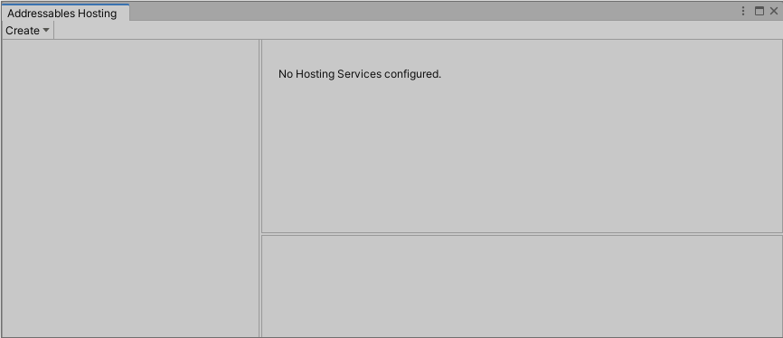
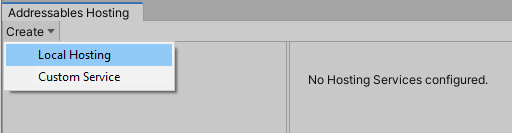
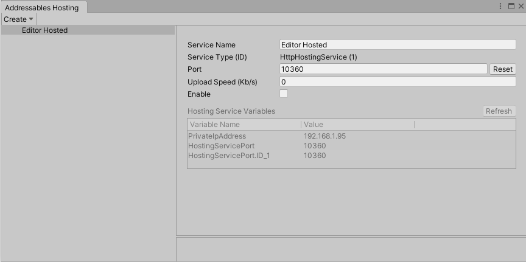
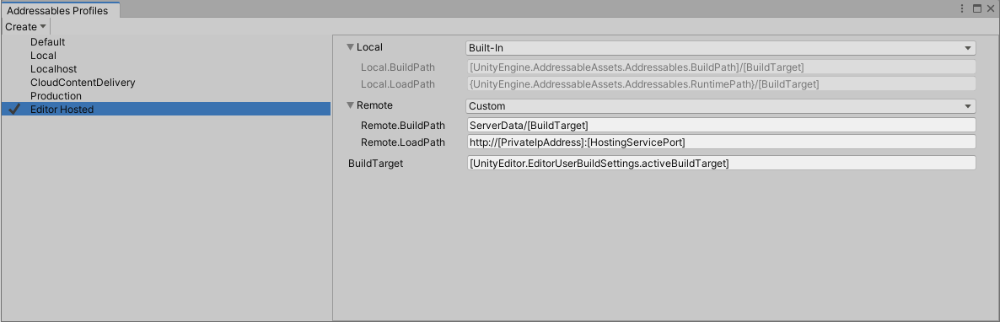
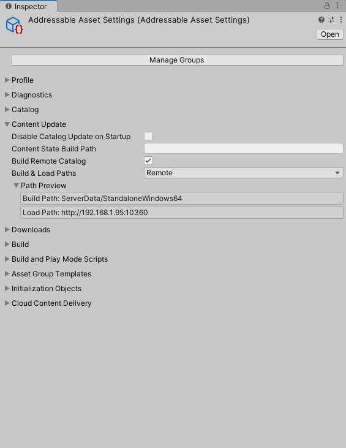
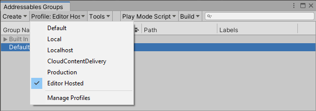
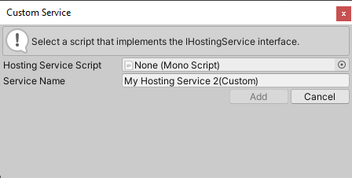

# Asset Hosting Services

## Overview
Hosting Services provide an integrated facility for using Addressable Assets configuration data to serve packed content to local or network-connected application builds from within the Unity Editor. Hosting Services can improve iteration velocity when testing packed content and can also serve content to connected clients on local and remote networks.

### Packed mode testing and iteration
Moving from Editor Play mode testing to platform application build testing introduces complexities and time costs to the development process. Hosting Services provide extensible Editor-embedded content delivery services that map directly to your Addressables group configuration. Using a custom Addressables profile, you can configure your application to load all content from the Unity Editor itself. This includes builds deployed to mobile devices, or any other platform, that have network access to your development system.

## Setup
This article details the initial setup of Asset Hosting Services for your project. While the setup guide focuses on Editor workflows, you can use the API to configure Hosting Services by setting the [HostingServicesManager] property of the [AddressableAssetSettings] class.

### Configuring a new Hosting Service
Use the **Hosting window** to add, configure, and enable new Hosting Services. In the Editor, select **Window** > **Asset Management** > **Addressables** > **Hosting**, or click the **Tools** > **Window** > **Hosting Services** button from the **Addressables Groups** window menu to access the **Addressables Hosting** window.

</br>
_The **Addressables Hosting** window._

To add a new Local Hosting Service, click the **Create** > **Local Hosting** button.

</br>
_Adding a new Hosting Service._

**Note**: For more information on implementing custom hosting service types, see the section on [custom services].

The newly added service appears in the **Hosting Services** section of the **Addressables Hosting** window. Use the **Service Name** field enter a name for the service.

The new service defaults to the disabled state. To start the service, select the **Enable** check box.

</br>
_The updated **Addressables Hosting** window after adding a service._

The HTTP Hosting Service automatically assigns a port number when it starts. The service saves the port number and reuses it between Unity sessions. To choose a different port, either assign a specific port number in the **Port** field, or click the **Reset** button to assign a different, random port number.

In Editor versions 2022.1 and above, HTTP downloads are disallowed by default.  In order for the default `HTTPHostingService` to work correctly, you need to set the **Allow downloads over HTTP** setting in **Edit** > **Project Settings...** > **Player** > **Other Settings** > **Allow downloads over HTTP** to something other than **Not allowed**.

> [!WARNING]
> If you reset the port number, you must execute a full application build to generate and embed the correct URL.

> [!NOTE]
> You may need to disable your local firewall or add exceptions to allow connections from mobile or other devices.

The HTTP Hosting Service is now enabled and ready to serve content from the directory specified in the remote [BuildPath] of each asset group.

### Hosting Service profile setup
When working with Hosting Services during development, consider creating a profile that configures your asset groups to load from the Hosting Service. For more about profiles, see [Addressable Assets Profiles].

Once in the **Addressables Profiles** window, create a new profile via **Create** > **Profile**. In the following example, the new profile is called "Editor Hosted".

Modify the remote loading URL to load from the Hosting Service. From the **Addressables Hosting** window, you can use the fields named `[PrivateIpAddress]` and `[HostingServicePort]` in the remote __LoadPath__ variable to construct the path URL (for example, `http://[PrivateIpAddress]:[HostingServicePort]`).

</br>
_Configuring the service's profile._

Verify that each group is configured correctly. Ensure that you set the [BuildPath] and [LoadPath] paths to their respective profile keys that you modified for use with Hosting Services. In this example, you can see how the profile variables in the [LoadPath] should be expanded to build a correct base URL for loading assets from Hosted Services.

</br>
_Inspecting the service's load paths._

> [!TIP]
> Use the __Path Preview__ to verify that the profile variables resolve to the correct variables. The load path URL IP address and port must match those shown for the service on the __Addressables Hosting__ window.

Finally, select the new profile from the **Addressables Groups** window, create a build, and deploy to the target device. The Unity Editor now serves all load requests from the application through the [HttpHostingService] service. You can now make additions and changes to content without redeployment. Rebuild the Addressable content, and relaunch the already deployed application to refresh the content.

</br>
_Selecting a Hosting Service profile._

### Batch mode
You can also use Hosting Services to serve content from the Unity Editor running in batch mode. To do so, launch Unity from the command line with the following options:

```
-batchMode -executeMethod UnityEditor.AddressableAssets.HostingServicesManager.BatchMode
```

This loads the Hosting Services configuration from the default [AddressableAssetSettings] object, and starts all configured services.

To use an alternative [AddressableAssetSettings] configuration, create your own static method entry point, to call through the [HostingServicesManager.BatchMode(AddressableAssetSettings settings)] overload.

<a name="custom-services"></a>
## Custom services
You can create a custom service to implement your own logic for serving content-loading requests from the Addressable assets system. For example:

* Support a custom [IResourceProvider] that uses a non-HTTP protocol for downloading content.
* Manage an external process for serving content that matches your production CDN solution (such as an Apache HTTP server).

### Implementing a custom service
The [HostingServicesManager] can manage any class that implements an [IHostingService] interface (for more details on method parameters and return values, see the [API documentation].

To create a new custom service:

1. Follow the steps outlined in the [configuring a new Hosting Service] section above, but instead of selecting **Create** > **Local Hosting** button, select **Create** > **Custom Service** button instead. 
2. Drag the applicable script into its field, or select it from the object picker. The dialog validates that the selected script implements the [IHostingService] interface. 
3. To finish adding the service, click the **Add** button. 

Moving forward, your custom service will appear in the **Service Type** drop-down options.

</br>
_Adding a custom Asset Hosting Service._


[Addressable Assets Profiles]: xref:addressables-profiles
[AddressableAssetSettings]: xref:UnityEditor.AddressableAssets.Settings.AddressableAssetSettings
[API documentation]: xref:UnityEditor.AddressableAssets.HostingServices.IHostingService
[BuildPath]: xref:UnityEditor.AddressableAssets.Settings.GroupSchemas.BundledAssetGroupSchema.BuildPath
[configuring a new Hosting Service]: #configuring-a-new-hosting-service
[custom services]: #custom-services
[HostingServicesManager.BatchMode(AddressableAssetSettings settings)]: xref:UnityEditor.AddressableAssets.HostingServices.HostingServicesManager.BatchMode(UnityEditor.AddressableAssets.Settings.AddressableAssetSettings)
[HostingServicesManager]: xref:UnityEditor.AddressableAssets.HostingServices.HostingServicesManager
[HttpHostingService]: xref:UnityEditor.AddressableAssets.HostingServices.HttpHostingService
[IHostingService]: xref:UnityEditor.AddressableAssets.HostingServices.IHostingService
[IResourceProvider]: xref:UnityEngine.ResourceManagement.ResourceProviders.IResourceProvider
[LoadPath]: xref:UnityEditor.AddressableAssets.Settings.GroupSchemas.BundledAssetGroupSchema.LoadPath
