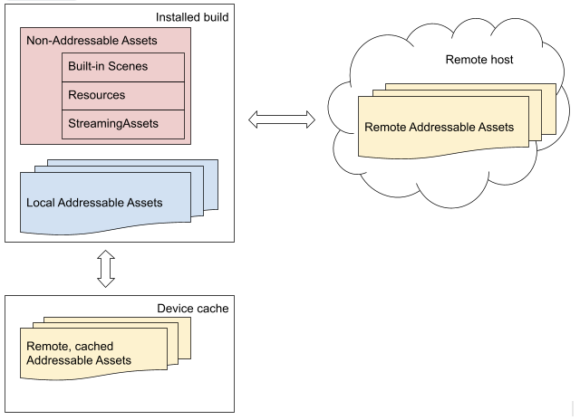

# Overview of the Addressables system

Addressables provides a system that can grow with your project. You can start with a simple setup and then reorganize as your project grows in complexity and your team grows in size, and you can do this all with minimal code changes. 

For example, you could start with a single group of Addressable assets, which Unity loads as a set. Then, as you add more content, you could split your assets into multiple groups so that you can load only the ones you need at a given time. As your team grows in size, you could make separate Unity Projects for developing different types of assets. These auxiliary Projects can produce their own Addressables content builds that you load from the main Project (again with minimal code changes). 

This overview discusses the following concepts to help you understand how to manage and use your assets with the Addressables system:

* __Asset address__: a string ID that identifies an Addressable asset. You can use an address as a key to load the asset. 
* __AssetReferences__: a type you can use to support the assignment of Addressable assets to fields in an Inspector window. You can use an AssetReference instance as a key to load the asset. The [AssetReference] class also provides its own loading methods.
* __Label__: a tag that you can assign to multiple assets and use to load related assets together as a group. You can use a label as a key to load the asset.
* __Asset location__: a runtime object that describes how to load an asset and its dependencies. You can use a location object as a key to load the asset.
* __Key__: an object that identifies one ore more Addressables. Keys include addresses, labels, AssetReference instances and location objects.
* __Asset loading and unloading__: the Addressables API provides its own functions to load and release Assets at runtime.
* __Dependencies__: An asset dependency is one asset used by another, such as a Prefab used in a Scene asset or a Material used in a Prefab asset.
* __Dependency and resource management__: the Addressables system uses reference counting to track which assets and AssetBundles are in use, including whether the system should load or unload dependencies (other referenced Assets).
* __Group__: you assign assets to groups in the Editor. The group settings determine how Addressables packages the group assets into AssetBundles and how it loads them at runtime.
* __Content catalogs__: Addressables uses catalogs to map your assets to the resources that contain them.
* __Content builds__: when using Addressables, you make a content build to collate and package your assets as a separate step before you make a player build.
* __Multiple platform support__: the build system separates content built by platform and resolves the correct path at runtime.
* __Addressables tools__: the Addressables package contains several windows and tools to organize, build, and optimize your content.

By default, Addressables uses AssetBundles to package your assets. You can also implement your own [IResourceProvider] class to support other ways to access assets.

<!-- See [Managing Assets] in the Unity manual for additional information about choosing an asset management strategy for your project. -->

## Asset addresses

A key feature of the Addressables system is that you assign addresses to your assets and use those addresses to load them at runtime. The Addressables resource manager looks up the address in the content catalog to find out where the asset is stored. (Assets can be built-in to your application, cached locally, or hosted remotely.) The resource manager loads the asset and any dependencies, downloading the content first, if necessary. 

 *Addressables loads Assets by address no matter where they're located*

Because an address isn't tied to the physical location of the Asset, you have much more flexibility when managing and optimizing your Assets, both in the Unity Editor and at runtime. [Content catalogs] map Addresses to physical locations.

Although, you should typically assign unique addresses to your assets, an asset address is not required to be unique. You can assign the same address string to more than one asset when useful. For example, if you have variants of an asset, you could assign the same address to all the variants and use labels to distinguish between the variants:

* Asset 1: address: "plate_armor_rusty", label: "hd"
* Asset 2: address: "plate_armor_rusty", label: "sd"

Addressables API functions that only load a single asset, such as [LoadAssetAsync], load the first instance found if you call them with an address assigned to multiple assets. Other functions, like [LoadAssetsAsync], load multiple assets in one operation and load all the assets with the specified address. 

> [!TIP]
> You can use the [MergeMode] parameter of [LoadAssetsAsync] to load the intersection of two keys. 
>
>In the example above, you could specify the address, "plate_armor_rusty", and the label, "hd", as keys and intersection as the merge mode to load "Asset 1". You could change the label value to "sd" to load "Asset 2". 

See [Making an asset Addressable] for how to assign addresses to assets.

See [Loading assets] for how to load assets by keys, including addresses.

## AssetReference

An AssetReference is a type that you can set to any kind of Addressable asset. Unity does not automatically load the asset assigned to the reference, so you have more control over when to load and unload it. 

Use fields of type AssetReference in your MonoBehaviours and ScriptableObjects to help you specify which Addressable asset to use for that field (instead of using the string that specifies the address). AssetReferences support drag-and-drop and object picker assignment, which can make them more convenient to use in an Editor Inspector.

In addition to the base AssetReference type, Addressables provides a few more specialized types, such as AssetReferenceGameObject and AssetReferenceTexture. You can use these specialized subclasses to eliminate the possiblity of assigning the wrong type of asset to an AssetReference field. In addition, you can use the AssetReferenceUILabelRestriction attribute to limit assignment to Assets with specific labels.

See [Using AssetReferences] for more information.

## Loading and releasing assets

To load an Addressable asset, you can use its address or other key such as a label or AssetReference. See [Loading Addressable Assets] for more information. You only need to load the main asset; Addressables loads any dependent assets automatically.

When your application no longer needs access to an Addressable asset at runtime, you must release it so that Addressables can free the associated memory. The Addressables system keeps a reference count of loaded assets. It doesn't unload an asset until the reference count returns to zero. Thus, you don't need to keep track of whether an asset or its dependencies are still in use; you only need to make sure that anytime you explicitly load an asset, you release it when your application no longer needs that instance. See [Releasing Addressable assets] for more information.

## Dependency and resource management

One asset in Unity can depend on another. A Scene might reference one or more Prefabs; a Prefab might use one or more Materials. The same Material can be used by more than one Prefab and those Prefabs can exist in different AssetBundles. When you load an Addressable asset, the system automatically finds and loads any dependent assets that it references. When the system unloads an asset, it also unloads its dependencies -- unless they're still being used by a different asset.

As you load and release assets, the Addressables system keeps a reference count for each item. When an asset is no longer referenced, Addressables unloads it. If the asset was in a bundle that no longer contains any assets that are in use, Addressables also unloads the bundle.

See [Memory management] for more information.

## Addressables groups and labels

Use Addressables groups to organize your content. All Addressable Assets belong to a group. If you don't explicitly assign an asset to a group, Addressables adds it to the default group.

You can set the group settings to specify how the Addressables build system should package the assets in a group into bundles. For example, you can choose whether or not all the assets in a group should be packed together in a single AssetBundle file.

Use labels to tag content that you want to treat together in some way. For example, if you had labels defined for "red", "hat", and "feather", you could load all red hats with feathers in a single operation, whether or not they are part of the same AssetBundle. In addition, you can use labels to determine how assets in a group are packed into bundles.

Add an asset to a group and move assets between groups using the __[Addressables Groups]__ window. You can also assign labels to your assets in the Groups window.

### Group schemas

The schemas assigned to a group define the settings used to build the assets in a group. Different schemas can define different groups of settings. For example, one standard schema defines the settings for how to pack and compress your assets into AssetBundles (among other options). Another standard schema defines which of the categories, "Can Change Post Release" and "Cannot Change Post Release" the assets in the group belong to. 

You can define your own schemas to use with custom build scripts.

See [Schemas] for more information about group schemas.

## Content catalogs

The Addressables system produces a content catalog file that maps the addresses of your assets to their physical locations. Addressables produces one content catalog per project, but you can load catalogs created by other Unity Projects to load Addressable assets produced by those Projects. This allows you to use separate Projects to develop and build some of your assets, which can make iteration and team collaboration easier on large productions.

When Addressables produces the content catalog, it also creates a hash file containing the hash (a mathematical fingerprint) of the catalog. If you are hosting your Addressable assets remotely, the system uses this hash file to determine if the content catalog has changed and needs to be downloaded.

The Profile selected when you perform a content build determines how the addresses in the content catalog map to resource loading paths. See [Profiles] for more information.

See [Loading additional catalogs] for information about loading content catalogs.

See [Distributing content remotely] for information about hosting content remotely.

See [Managing catalogs at runtime] if you want to load additional catalogs or override the default update behavior.

## Content builds

The Addressables system separates the building of Addressable content from the build of your player. A content build produces the content catalog, catalog hash, and the AssetBundles containing your assets. 

Because asset formats are platform-specific, you must make a content build for each platform before building a player. 

See [Building Addressable content] for more information.

## Play mode scripts

When you run your game or application in the Editor Play mode, it can be inconvenient and slow to always perform a content build before pressing the Play button. At the same time, you do want to be able to run your game in a state as close to a built player as possible. For flexibility, Addressables provides three options that determine how the Addressables system locates and loads assets in Play mode:

* __Use the Asset database__: Addressables loads Assets directly from the Asset database. This option typically provides the fastest iteration speed if you are making both code and Asset changes, but also least resembles a production build. 
* __Simulate groups__: Addressables loads Assets while simulating groups. This option is helpful if you are working on organizing and optimizing your Addressables groups themselves. It provides Addressables events without requiring a full content rebuild after every change.
* __Use existing build__: Addressables loads content from your last content build. This option most resembles a production build and can provide fast iteration turnaround if you aren't changing Assets.

See [Play mode Scripts] for more information.

## Support for multiple platforms

Addressables supports projects designed for multiple platforms by including the target platform name in the build path and by making sure that it copies the correct platform files to the StreamingAssets folder when you make a player build.

## Addressables tools

The Addressables system provides a few tools and windows to help you manage your Addressable assets:

* [Addressable Groups window]\: The Groups window is the main interface for managing assets, group settings, and making builds..
* [Profiles window]: helps set up paths used by your builds.
* [Addressables Event Viewer]: monitor and profile runtime events related to your Addressable assets.
* [Analyze tool]: the Analyze tool runs analysis rules that check whether your Addressables content conforms to the set of rules you have defined. The Addressables system provides some basic rules, such as checking for duplicate assets; you can add your own rules using the [AnalyzeRule] class.
* [Hosting tool]: the Hosting tool provides a simple asset hosting service that runs from the Unity Editor to aide development and testing of your project.  
* [Build layout report]: describes the AssetBundles produced by a content build.

[Addressable Groups window]: xref:addressables-groups#groups-window
[Addressables Groups]: xref:addressables-groups#groups-window
[Addressables Event Viewer]: xref:addressables-event-viewer
[AnalyzeRule]: xref:UnityEditor.AddressableAssets.Build.AnalyzeRules.AnalyzeRule
[Analyze tool]: xref:addressables-analyze-tool
[Building Addressable content]: xref:addressables-builds
[Build layout report]: xref:addressables-build-layout-report
[Content catalogs]: #content-catalogs
[Distributing content remotely]: xref:addressables-remote-content-distribution
[Hosting tool]: xref:addressables-asset-hosting-services
[IResourceProvider]: xref:UnityEngine.ResourceManagement.ResourceProviders.IResourceProvider
[Loading additional catalogs]: xref:addressables-api-load-content-catalog-async#loading-additional-catalogs
[Loading Addressable Assets]: xref:addressables-api-load-asset-async
[Loading assets]: xref:addressables-api-load-asset-async
[Making an asset Addressable]: xref:addressables-getting-started#making-an-asset-addressable
[Managing Assets]: xref:AssetWorkflow
[Managing catalogs at runtime]: xref:addressables-api-load-content-catalog-async
[Memory management]: xref:addressables-memory-management
[Play mode Scripts]: xref:addressables-groups#play-mode-scripts
[Profiles window]: xref:addressables-profiles
[Profiles]: xref:addressables-profiles
[Releasing Addressable assets]: xref:addressables-api-load-asset-async#releasing-addressable-assets
[Schemas]: xref:addressables-group-settings#schemas
[Using AssetReferences]: xref:addressables-asset-references
[AssetReference]: xref:addressables-asset-references
[LoadAssetAsync]:  xref:UnityEngine.AddressableAssets.Addressables.LoadAssetAsync*
[LoadAssetsAsync]: xref:UnityEngine.AddressableAssets.Addressables.LoadAssetsAsync``1(System.Collections.Generic.IList{System.Object},System.Action{``0},UnityEngine.AddressableAssets.Addressables.MergeMode)
[MergeMode]: xref:UnityEngine.AddressableAssets.Addressables.MergeMode
