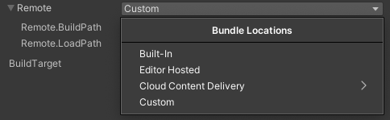
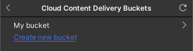
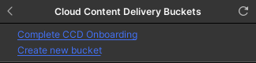
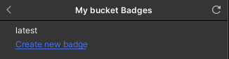
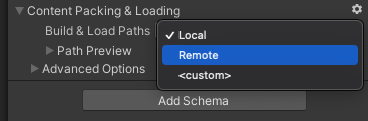
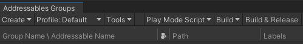

# Addressable Asset system with Cloud Content Delivery

You can use the [Addressable asset system] in conjunction with [Unity Cloud Content Delivery] \(CCD) to distribute your remote Addressables content.

**Note**: The purpose of this page is to describe how to link the concepts of Addressable Assets to CCD, and isn't meant to be an in-depth discussion of these ideas. Before you read this page, make sure you are familiar with both the Addressable system and Cloud Content Delivery.

To set up Addressable assets to work with CCD:
1. [Configure a profile to include your CCD URL]
2. [Build your AssetBundles, then upload them to CCD]

See [Getting Started] for information about installing and implementing the Addressables package.

See [Upgrading to the Addressables System] for information about integrating Addressables in an existing Unity Project.

See [Remote content distribution] for information on how to set up your Project so that you can host your Addressables content on a remote server.

See [Unity Cloud Content Delivery] for more information about CCD.

## Configure profile with CCD URL

> [!TIP]
> The `BuildPath` and `LoadPath` variables stored in [Profiles] specify where the Addressables system creates your build artifacts and where it looks for your assets at runtime. Configure the remote paths to work with CCD. (Leave the local paths with their standard, default values, unless you have a specific reason to change them.)

If necessary, create a new profile for publishing builds to CCD on the [Profiles] window. Configure the remote path variables in this profile to access your content at the correct URL.

You can set the remote `BuildPath` to a convenient value. If you have multiple profiles, consider using a unique build path for each of them so that the build artifacts do not get mixed together, especially if you are hosting them from a different remote URL.

Set the remote `LoadPath` to one of the following two paths:

* If you publish content using a badge: 

```c#
  https://(ProjectID).client-api.unity3dusercontent.com/client_api/v1/buckets/(BucketID)/release_by_badge/(BadgeName)/entry_by_path/content/?path=

```

* If you publish using a release: 

```c#
  https://(ProjectID).client-api.unity3dusercontent.com/client_api/v1/buckets/(BucketID)/releases/(ReleaseID)/entry_by_path/content/?path=

```

where:
* `(ProjectID)` is your CCD project's ID string
* `(BucketID)` is the Bucket ID string for a CCD bucket within your project
* `(ReleaseID)` is the ID of a specific release within a bucket
* `(BadgeName)` is the name of the specific CCD badge

See [Profiles] for information about how to create and edit profiles.

> [!IMPORTANT]
> You must perform a full rebuild your Addressables content when you change the remote load path.

<a name="ccd-bundle-location"></a>
### Using the Cloud Content Delivery Bundle Location Option in a Profile

If your project is set up to use the [Unity Cloud Content Delivery] service, you can set the profile's remote path pair to publish content to a designated bucket and badge.

To set up a Profile variable to use the CCD bundle location:

1. Open the Profile window (menu: __Window > Asset Management > Addressables > Profiles__).
2. Select the profile to change.
3. Change the __Remote__ variable to use the __Cloud Content Delivery__ __Bundle Location__.
   <br/><br/>*Cloud Content Delivery Bundle Location Option*

4. Choose the Bucket to use.
   <br/><br/>*Cloud Content Delivery Bundle Location Option*

> [!Note]
> If no buckets are present, you will be shown this window before continuing.
> <br/><br/>*Cloud Content Delivery Bundle Location Option*

5. Choose the Badge.
   <br/><br/>*Cloud Content Delivery Bundle Location Option*

Make this the active profile when building content for delivey with CCD.

> [!Important]
> This feature requires the Content Delivery Management API package, which is currently in an experimental state.

See [Profiles] for information about how to modify profiles.


## Configure groups with CCD URL

Configure groups to use __Remote__ as their __Build & Load Path__ in the inspector window.

<br/>*Group Build & Load Paths*

See [Groups] for information about how to modify groups.

<a name="build-upload-release"></a>
## Build, upload and release Addressable content
### Using to CCD Dashboard/CLI

To generate and upload Addressable content to your CCD project:

1. Set the profile you have set up for CCD as the active profile.
2. Build your Addressables content. 
   * If you are making a full content build, see [Building your Addressable content].
   * If your are updating an existing build with modified remote content, see [Building for content updates].
3. Upload the files created at the remote build path using the [CCD dashboard] or [command-line interface].
4. Create a release and update the badge using the [CCD dashboard] or [command-line interface].

Building your Addressable content generates a content catalog  (.json), a hash file (.hash), and one or more AssetBundle (.bundle) files. Upload these files to the bucket corresponding to the URL used in your profile load path.

If you have made changes to local content, you must create a new Player build.

If you are using the Unity Cloud Build service, you can configure your cloud builds to send content to CCD. See [Using Addressables in Unity Cloud Build] for information.


### Using CCD Management package
To generate, upload, and release Addressable content to your CCD project:

1. Open the Groups window (menu: __Window > Asset Management > Addressables > Groups__).
2. Use the __Build & Release__ option.

The CCD Management package will use the default build script behavior to generate the Addressable bundles.
Then, all groups associated with a path pair that is connected to a CCD bucket and badge via the drop-down window will have their generated bundles uploaded by the management package to those remote target.
Finally, the management package will a create release for those remote target and update their badge.

<br/><br/>*Build & Release option*


[Getting Started]: xref:addressables-getting-started
[Upgrading to the Addressables System]: xref:addressables-migration
[Remote content distribution]: xref:addressables-remote-content-distribution
[Profiles]: xref:addressables-profiles
[default values]: xref:addressables-profiles#default-path-values
[Addressable Asset system]: xref:addressables-home
[Asset Hosting Services]: ./AddressableAssetsHostingServices.md
[AssetBundles]: xref:AssetBundlesIntro
[Build your AssetBundles, then upload them to CCD]: #build-upload-release
[Building for content updates]: ./ContentUpdateWorkflow.md#building-content-updates
[Building your Addressable content]: xref:addressables-building-content
[Configure a profile to include your CCD URL]: #configure-profile-with-ccd-url
[Marking assets as Addressable]: xref:addressables-getting-started#making-an-asset-addressable
[Unity Cloud Content Delivery]: https://docs.unity3d.com/Manual/UnityCCD.html
[Using Addressables in Unity Cloud Build]: xref:UnityCloudBuildAddressables
[Groups]: xref:addressables-groups
[CCD dashboard]: https://docs.unity.com/ccd/Content/UnityCCDDashboard.htm
[command-line interface]: https://docs.unity.com/ccd/Content/UnityCCDCLI.htm
