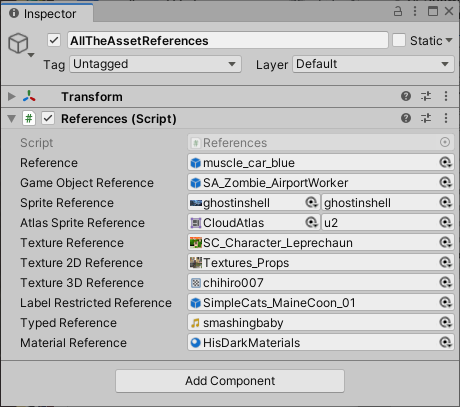

# Asset References

An [AssetReference] is a type that can reference an Addressable asset.

Use the AssetReference class in a MonoBehaviour or ScriptableObject. When you add a serializable AssetReference field to one of these classes, you can assign a value to the field in an Inspector window. You can restrict the assets that can be assigned to a field by type and by label. 

<br/>*An Inspector window showing several AssetReference fields*

To assign a value, drag an asset to the field or click on the object picker icon to open a dialog that lets you choose an Addressable asset.

If you drag a non-Addressable asset to an AssetReference field, the system automatically makes the asset Addressable and adds it to your default Addressables group. Sprite and SpriteAtlas assets can have subobjects. AssetReferences assigned these types of asset display an additional object picker that allows you to specify which subobject to reference.

See the [Basic AssetReference], [Component Reference], and [Sprite Land] projects in the [Addressables-Sample] repository for examples of using AssetReferences in a project.

> [!IMPORTANT]
> To be able to assign assets from a group to an AssetReference field, the __Include GUID in Catalog__ option must be enabled in the group’s Advanced Settings. The __Include GUID in Catalog__ option is enabled by default.

## AssetReference types

The Addressables API provides [AssetReference] subclasses for common types of assets. You can use the generic subclass, [AssetReferenceT\<TObject\>], to restrict an AssetReference field to other asset types.

The types of AssetReference include:

* [AssetReference]: can reference any asset type
* [AssetReferenceT\<TObject\>]: can reference assets that are the same type as `TObject`
* [AssetReferenceTexture]: can reference a [Texture] asset
* [AssetReferenceTexture2D]: can reference a [Texture2D] asset
* [AssetReferenceTexture3D]: can reference a [Texture3D] asset
* [AssetReferenceGameObject]: can reference a [Prefab] asset
* [AssetReferenceAtlasedSprite]: can reference a [SpriteAtlas] asset
* [AssetReferenceSprite]: can reference a single [Sprite] asset

> [!NOTE]
> If you want to use a [CustomPropertyDrawer] with a generic AssetReferenceT (or are using a version of Unity earlier than 2020.1), you must make a concrete subclass to support custom AssetReference types.

## Adding AssetReference fields to a class

Add an [AssetReference], or one of its subclasses, to a MonoBehaviour or ScriptableObject by declaring it as a serializable field to the class: 

[!code-cs[sample](../Tests/Editor/DocExampleCode/DeclaringReferences.cs#doc_DeclaringReferences)]

<!--
```csharp
using System;
using UnityEngine;
using UnityEngine.AddressableAssets;

public class References : MonoBehaviour
{
    // Any asset type
    public AssetReference reference;

    // Prefab assets
    public AssetReferenceGameObject gameObjectReference;

    // Sprite asset types
    public AssetReferenceSprite        spriteReference;
    public AssetReferenceAtlasedSprite atlasSpriteReference;

    // Texture asset types
    public AssetReferenceTexture   textureReference;
    public AssetReferenceTexture2D texture2DReference;
    public AssetReferenceTexture3D texture3DReference;

    // Any asset type with the specified labels
    [AssetReferenceUILabelRestriction("animals", "characters")]
    public AssetReference labelRestrictedReference;

    // Generic asset type (Unity 2020.3+)
    public AssetReferenceT<AudioClip> typedReference;

    // Custom asset reference class
    public AssetReferenceMaterial materialReference;

    [Serializable]
    public class AssetReferenceMaterial : AssetReferenceT<Material>
    {
        public AssetReferenceMaterial(string guid) : base(guid) { }
    }

    private void Start() {
        // Load assets...
    }

    private void OnDestroy() {
        // Release assets...
    }
}
```
-->

> [!NOTE]
> Before Unity 2020.1, the Inspector window couldn't display generic fields by default. In earlier versions of Unity, you must make your own non-generic subclass of AssetReferenceT instead. See [Creating a concrete subclass].

## Loading and releasing AssetReferences

The [AssetReference] class provides its own methods to load, instantiate, and release a referenced asset. You can also use an AssetReference instance as a key to any [Addressables] class method that loads assets.

The following example instantiates an AssetReference as a child of the current GameObject and releases it when the parent is destroyed:

[!code-cs[sample](../Tests/Editor/DocExampleCode/InstantiateReference.cs#doc_InstantiateReference)]

<!--
```csharp
using UnityEngine;
using UnityEngine.AddressableAssets;

public class InstantiateReference : MonoBehaviour
{
    [SerializeField]
    private AssetReferenceGameObject reference;

    void Start()
    {
        if (reference != null)
            reference.InstantiateAsync(this.transform);
    }

    private void OnDestroy() {
        if (reference != null && reference.IsValid())
            reference.ReleaseAsset();
    }
}
```
-->

See [Loading an AssetReference] for more information and examples about loading assets using AssetReferences.

## Restricting AssetReference assignment to assets with specific labels

Use the [AssetReferenceUILabelRestriction] attribute to restrict the assets you can assign to an [AssetReference] field to those with specific labels. You can use this attribute reference in addition to AssetReference subclasses to restrict assignment by both type and label.

The following example prevents someone from assigning an Addressable asset to a reference that does not have either the label, "animals", or the label, "characters":

[!code-cs[sample](../Tests/Editor/DocExampleCode/DeclaringReferences.cs#doc_RestrictionAttribute)]

<!--
```csharp
    [AssetReferenceUILabelRestriction("animals", "characters")]
    public AssetReference labelRestrictedReference;
```
-->

> [!Note]
> * The attribute only prevents assigning assets without the specified label using an Inspector in the Unity Editor. Someone could still assign an asset without the label to the field using a script.
> * You cannot drag non-Addressable assets to a field with the `AssetReferenceUILabelRestriction` attribute.

## Creating a concrete subclass

For those cases in which you cannot use the generic form of the [AssetReference] class directly (in versions of Unity prior to Unity 202.1 or when using the [CustomPropertyDrawer] attribute), you can create a concrete subclass.

To create a concrete subclass, inherit from the [AssetReferenceT] class and specify the asset type. You must also pass the GUID string to the base class constructor:

[!code-cs[sample](../Tests/Editor/DocExampleCode/DeclaringReferences.cs#doc_ConcreteSubclass)]

<!--
```csharp
    [Serializable]
    public class AssetReferenceMaterial : AssetReferenceT<Material>
    {
        public AssetReferenceMaterial(string guid) : base(guid) { }
    }
```
-->

You can use your custom AssetReference subclass in another script the same way as other AssetReference types:

[!code-cs[sample](../Tests/Editor/DocExampleCode/DeclaringReferences.cs#doc_UseConcreteSubclass)]

<!--
```csharp
    // Custom asset reference class
    public AssetReferenceMaterial materialReference;
```
-->

[Addressables]: xref:UnityEngine.AddressableAssets.Addressables
[AssetReference]: xref:UnityEngine.AddressableAssets.AssetReference
[AssetReferenceAtlasedSprite]: xref:UnityEngine.AddressableAssets.AssetReferenceAtlasedSprite
[AssetReferenceGameObject]: xref:UnityEngine.AddressableAssets.AssetReferenceGameObject
[AssetReferenceSprite]: xref:UnityEngine.AddressableAssets.AssetReferenceSprite
[AssetReferenceT\<TObject\>]: xref:UnityEngine.AddressableAssets.AssetReferenceT`1
[AssetReferenceT]: xref:UnityEngine.AddressableAssets.AssetReferenceT`1
[AssetReferenceTexture]: xref:UnityEngine.AddressableAssets.AssetReferenceTexture
[AssetReferenceTexture2D]: xref:UnityEngine.AddressableAssets.AssetReferenceTexture2D
[AssetReferenceTexture3D]: xref:UnityEngine.AddressableAssets.AssetReferenceTexture3D
[CustomPropertyDrawer]: xref:editor-PropertyDrawers
[Loading an AssetReference]: xref:addressables-api-load-asset-async#loading-an-assetreference
[Prefab]: xref:Prefabs
[Sprite]: xref:Sprites
[SpriteAtlas]: xref:class-SpriteAtlas
[Texture]: xref:UnityEngine.Texture
[Texture2D]: xref:UnityEngine.Texture2D
[Texture3D]: xref:UnityEngine.Texture3D
[AssetReferenceUILabelRestriction]: xref:UnityEngine.AssetReferenceUILabelRestriction
[Creating a concrete subclass]: #creating-a-concrete-subclass
[Basic AssetReference]: https://github.com/Unity-Technologies/Addressables-Sample/tree/master/Basic/Basic%20AssetReference
[Component Reference]: https://github.com/Unity-Technologies/Addressables-Sample/tree/master/Basic/ComponentReference
[Sprite Land]: https://github.com/Unity-Technologies/Addressables-Sample/tree/master/Basic/Sprite%20Land
[Addressables-Sample]: https://github.com/Unity-Technologies/Addressables-Sample
