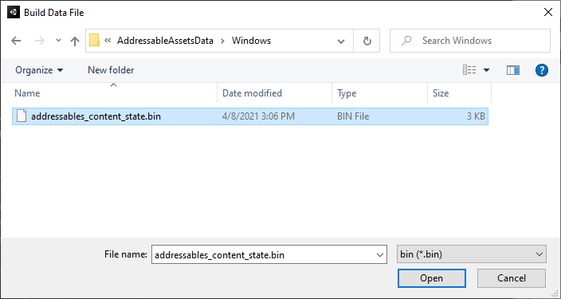

# Making builds

When you use the Addressables package, you can build your content (AssetBundles) as a separate step from your application player. The Addressables package provides its own build scripts for this purpose, accessible from the toolbar of the [Groups window]. 

You have two options when building o project. You can build your Addressables content as part of the Player build or you can build them as separate steps.

## Making a full build

To build your content artifacts:

1. Configure your Group settings.
2. If you are distributing content remotely, configure your Profile and Addressables system settings to enable remote content distribution.
3. Select the correct Profile.
4. Launch the build from the [Groups window]. 

> [!TIP]
> If you encounter build or runtime loading issues during development, consider running the __Clean > All__ command from the __Build__ menu before you rebuild your content.

### Setting up build and load paths

A [Profile] defines separate variables for the build and load paths of local versus remote content. You can create multiple profiles in order to use different paths for different kinds of builds. For example, you could have a profile to use while you develop your Project in the Editor and another for when you publish your final content builds.

For most Projects, you only need multiple profiles when you support remote content distribution. You don't typically need to change the local paths at different stages of your development process. Most projects should build local content to the default local build path and load it from the default local load path (which resolves to the StreamingAssets folder).

> [!WARNING]
> Windows has a file path limit of 260 characters.  If the build path of your content ends up creating a path that meets or exceeds the limit on Windows, the build fails. 
It is also possible to run into this issue if your project is located in a directory that is close to the character limit.  The Scriptable Build Pipeline creates AssetBundles in a temporary directory during the build.  This temporary path is a sub-directory of your project and can end up generating a `string` that goes over the Windows limit.
If the Addressables content build fails with a `Could not find a part of the path` error, and you're on Windows, this is a likely culprit.

#### Default local paths

The local build path defaults to the path provided by [Addressables.BuildPath], which is within the Library folder of your Unity project. Addressables appends a folder to the local build path based on your current platform build target setting. When you build for multiple platforms, the build places the artifacts for each platform in a different subfolder.

Likewise, the local load path defaults to that provided by [Addressables.RuntimePath], which resolves to the StreamingAssets folder. Again Addressables adds the platform build target to the path. 

When you build your local bundles to the default build path, then the build code temporarily copies the artifacts from the build path to the StreamingAssets folder when you build your player (and removes them after the build).

> [!WARNING]
> If you build to or load from custom local paths, then it becomes your responsibility to copy your build artifacts to the correct place in your project before making a player build and to make sure your application can access those artifacts at runtime. 

#### Default remote paths

Addressables sets the default remote build path to an arbitrarily chosen folder name, "ServerData", which is created under your Project folder. The build adds the current platform target to the path as a subfolder to separate the unique artifacts for different platforms. 

The default remote load path is "http://localhost/" appended with the current profile BuildTarget variable. You MUST change this path to the base URL at which you plan to load your Addressable assets. 

Use different profiles to set up the remote load path as appropriate for the type of development, testing, or publishing you are doing. For example, you could have a profile that loads assets from a localhost server for general development builds, a profile that loads assets from a staging environment for QA builds, and one that loads assets from your Content Delivery Network (CDN) for release builds. See [Hosting] for more information about configuring hosting.

> [!NOTE]
> When running your game in the Editor, you can use the __Use Asset Database__ Play Mode Script to bypass loading assets through the remote or local load paths. This can be convenient, especially when you don't have a localhost server set up. However, it can hide group configuration and asset assignment mistakes.

### Setting up remote content builds

To set up a remote content build:

1. Navigate to your AdressablesSystemSetting asset (menu: __Window > Asset Management > Addressables > Settings__).
2. Under __Catalog__, enable the __Build Remote Catalog__ option. 
The __BuildPath__ and __LoadPath__ settings for the catalog must be the same as those you use for your remote groups. In most cases, use the RemoteBuildPath and RemoteLoadPath profile variables.
3. For each group that you want to build as remote content, set the __BuildPath__ and __LoadPath__ to the RemoteBuildPath and RemoteLoadPath profile variables (or a custom value if desired).
4. Open the [Profiles window]  (menu: __Window > Asset Management > Addressables > Profiles__).
5. Set the RemoteLoadPath variable to the URL where you plan to host your remote content. 
If you require different URLs for different types of builds, create a new Profile for each build type. See [Profiles] and [Hosting] for more information. 

See [Remote content distribution] for additional information.

### Performing the build

After you have your group and Addressables system settings configured, you can run a content build:

1. Open the [Groups window]  (menu: __Windows > Asset Management > Addressables > Groups__).
2. Select the desired profile from the __Profile__ menu on the toolbar.
3. Select the __Default Build Script__ from the __Build > New Build__ menu. (If you have created your own build scripts they will also be available from this menu.)

The Default Build Script creates one or more AssetBundles for each group and saves them to either the local or the remote build path.

## Making an update build

When you distribute content remotely, you can perform a differential update of the previously published build to minimize the amount of data your users must download (compared to a full build). 

Once you have configured your remote groups properly and have a previous build which contains remote content, you can perform a content update build by:

1. Open the [Groups window]  (menu: __Windows > Asset Management > Addressables > Groups__).
2. Select the desired profile from the __Profile__ menu on the toolbar.
3. Select the __Update a Previous Build__ from the __Build__ menu.
   
   *The file picker dialog opens.*

4. Locate the `addressables_content_state.bin` file produced by the build you are updating. (The default location is in your `Assets/AddressableAssetsData/TargetPlatform` folder.)
5. Click __Open__ to start the update build.

To update existing clients, copy the updated remote content to your hosting service (after appropriate testing). (An update build does include all of your local and remote content -- any player builds you create after a content update build will contain a complete set of Addressable assets.) 

Note that updating a previous build does not change the `addressables_content_state.bin` file. Use the same version of the file for future update builds (until you publish another full build created from the __New Build__ menu). 

See [Content Update Builds] for information on how and when to use content update builds.

#### Shared AssetBundles
When building Addressable's content, there are two possible options for what we call "shared bundles".  These shared bundles are the `unitybuiltinshaders` AssetBundle, and the `MonoScript` AssetBundle.  

The former is generated if any built-in shaders are used by assets included in the build.  All Addressable assets that reference a shader that is built-in with the Unity Editor, such as the Standard Shader, do so by referencing this specialized shader AssetBundle..  

The latter can be toggled on or off by changing the **AddressableAssetSettings > MonoScript Bundle Naming Prefix** option.  The `MonoScript` bundle has naming options listed here, which are typically used in multi-project situations.  It is used to build `MonoScript` behaviors into AssetBundles that can be referenced as a dependency.

For both of these specialized AssetBundles, some build options are derived from the default `AddressableAssetGroup`.  If you plan on making content changes in the future, your default group, and by association the location of the shared bundles, should be remote.

If the shared bundles are built locally, they cannot be updated as part of a Content Update.  In the Content Update workflow, these bundles remain unchanged since they're generated at build time.  Essentially, once the `MonoScript` or build-in shaders bundle are included locally, they can never be changed without a new player build.

[Addressables.BuildPath]: xref:UnityEngine.AddressableAssets.Addressables.BuildPath
[Addressables.RuntimePath]: xref:UnityEngine.AddressableAssets.Addressables.RuntimePath
[Content Update Builds]: xref:addressables-content-update-builds
[Groups window]: xref:addressables-groups#groups-window
[Hosting]: xref:addressables-asset-hosting-services
[Profile]: xref:addressables-profiles
[Profiles window]: xref:addressables-profiles
[Profiles]: xref:addressables-profiles
[Remote content distribution]: xref:addressables-remote-content-distribution
