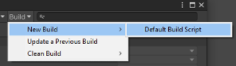

# Building content

A content build processes your Addressables groups to produce the content catalog and the AssetBundles that contain your assets.

You can configure the Addressables system to build your Addressables content as part of every Player build or you can build your content separately before making a Player build. See [Building Addressables content with Player builds] for more information about configuring these options.

If you configure Unity to build your content as part of the Player build, use the normal __Build__ or __Build and Run__ buttons on the Editor [Build Settings] window to start a build. You can also invoke the Editor on the command line, passing in one of the `-buildPlatformPlayer` options or use an API such as [BuildPipeline.BuildPlayer] to start the build. In all cases, Unity builds your Addressables content as a pre-build step before building the Player.

If you configure Unity to build your content separately, you must start the Addressables build using the __Build__ menu on the __Addressables Groups__ window as described in [Making builds]. The next time you build the Player for your project, it uses the artifacts produced by the last Addressables content build run for the current platform. See [Build scripting] for information about automating your Addressables build process.

Your content build can produce two general categories of content:

* __Local content__:  content that's included directly in your player build. The Addressables system manages local content automatically as long as you use the default build path for your local content. If you change the local build path, you must copy the artifacts from the local build path to the project's `Assets/StreamingAssets` folder before making a Player build.
* __Remote content__:  content that's downloaded from a URL after your application is installed. It is your responsibility to upload remote content to a hosting server so your application can access it the designated URL (specified by your [RemoteLoadPath]).

Your [Group settings] determine which category a group belongs to; the active [Profile] determines the specific paths and URLs that the Addressables system uses to build and load the content. (Your [Addressable Asset settings] also contain options that affect your content builds, such as whether to build remote content at all.)

You can start builds from a script as well as from the __Groups__ window. See [Build scripting] for more information. 

The Addressables system includes the following build scripts:

* __Default Build Script__:  performs a full content build based on Group, Profile, and Addressables system settings.
* __Update a Previous Build__:  performs a differential content build to update a previously created build.
* __Play Mode scripts__:  the Play Mode scripts are technically build scripts and control how the Editor accesses your content in Play Mode. See [Play Mode Scripts] for more information.

The build scripts also provide a function to clear the cached files they create. You can run these functions from the __Build > Clean Build__ menu of the [Groups window].

## Building Addressables content with Player builds

When you modify Addressable assets during development, you must rebuild your Addressables content before you build the Player. You can run the Addressables content build as a separate step before building a Player or you can run both the Addressables content build and the Player build together. 

Building Addressables content together with the Player can be convenient, but does increase build time, especially on large projects, since this rebuilds the Addressables content even when you haven't modified any assets. If you don't change your Addressables content between most builds, consider disabling this option.

The __Build Addressables on Player Build__ setting in the Project [Addressable Asset Settings](xref:addressables-asset-settings#build) specifies which option to use for building Addressables content. You can choose the appropriate option for each Project or defer to the global Preferences setting (which you can find in the __Addressables__ section of your Unity Editor Preferences). When you set a Project-level setting, it applies to all contributors who build the Project. The Preferences setting applies to all Unity Projects that don't set a specific value.

> [!NOTE] 
> Building Addressables on Player Build requires Unity 2021.2+. In earlier versions of Unity, you must build your Addressables content as a separate step.

## Build commands

Access build commands from the __Build__ menu on the toolbar at the top of the [Groups window].

The menu provides the following items:

* __New Build__:  choose a build script to run a full content build. The Addressables package includes one build script, __Default Build Script__. If you create custom build scripts, you can access them here (see [Build scripting]).
* __Update a Previous Build__:  run a differential update based on an earlier build. An update build can produce smaller downloads when you support remote content distribution and publish updated content. See [Content update builds].
* __Clean Build__:  choose a command to clean existing build cache files. Each build script can provide a clean up function, which you can invoke from this menu. (See [Build scripting].)

## Build artifacts

The build creates the following files that become part of the player build:

* Local AssetBundles (.bundle):  according to your group, profile, and platform settings
* settings.json:  contains Addressables configuration data used at runtime.
* catalog.json:  the catalog used to locate and load assets at runtime (if no newer remote catalog is available).
* link.xml:  prevents the Unity linker from stripping types used by your assets. See [Code Stripping].

The Addressables system copies these files into your [StreamingAssets] folder when you make a player build so that they're included in your application. It removes the files when the player build is finished.

The build also creates the following files that aren't copied to streaming assets:

* Remote AssetBundles (`.bundle`):  according to your group, profile, and platform settings. You must upload remote bundles to your hosting server.
* `catalog_timestamp.json`:  the catalog to upload to your hosting server (overrides the local catalog). An Addressables build only creates a remote catalog file if you enable the __Build Remote Catalog__ option in the project [Addressable Asset settings].
* `catalog_timestamp.hash`:  the hash file to upload to your hosting server. Used to check whether the remote catalog has changed since the last time a client app downloaded it.
* `addressables_content_state.bin`:  used to make a content update build. If you are supporting dynamic content updates, you must save this file after each full content build that you release. Otherwise, you can ignore this file. See [Content update builds].
* `AddressablesBuildTEP.json`:  build performance data. See [Build profiling]. 

[Addressable Asset settings]: xref:addressables-asset-settings		
[Build profiling]: xref:addressables-build-profile-log		
[Build scripting]: xref:addressables-api-build-player-content		
[Code Stripping]: xref:ManagedCodeStripping	
[Content update builds]:  xref:addressables-content-update-builds
[Group settings]: xref:addressables-group-settings		
[Groups window]: xref:addressables-groups#groups-window		
[Making builds]: xref:addressables-building-content		
[Play Mode Scripts]: xref:addressables-groups#play-mode-scripts		
[Profile]: xref:addressables-profiles	
[RemoteLoadPath]: xref:addressables-profiles
[StreamingAssets]: xref:StreamingAssets		
[Building Addressables content with Player builds]: #build-with-player
[Build Settings]: xref:PublishingBuilds
[BuildPipeline.BuildPlayer]: xref:UnityEditor.BuildPipeline.BuildPlayer(UnityEditor.BuildPlayerOptions)
