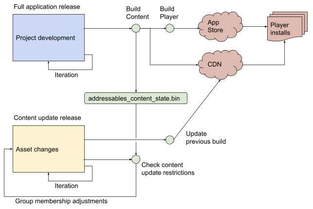

# Content update builds

The Addressables package includes tools that you can use to reduce the size of updates to the content you distribute remotely. 

The content update tools include:

* __[Check for Content Update Restrictions]__ tool: prepares your group organization for a content update build based on group settings
* __[Update a Previous Build]__ script: a build script that performs the content update build 

> [!IMPORTANT]
> You must save the **_addressables_content_state.bin_** file produced by the Default Build Script for each build that you intend to update in the future. This file is updated every time you run the build script. Be sure to save the version produced for the content build that you publish.  

For information on how to set up your Addressable groups for content updates, see [Group settings].

For information on how to perform a content update build, see [Building content updates].

For general information about how content updates work, including examples, see [Overview].  

> [!NOTE]
> On platforms that provide their own patching systems (such as Switch or Steam) or that do not support remote content distribution, do not use content update builds. Every build of your game should be a complete fresh content build. (In this case you can discard or ignore the *addressables_content_state.bin* file that is generated after each build for the platform.)

## Overview

When you distribute content remotely, you can make content changes without needing to rebuild and republish your entire application. When the Addressables system initializes at runtime, it checks for an updated content catalog. If one exists, the system downloads the new catalog and, when it loads assets, downloads the newer versions of all your AssetBundles.

However, when you rebuild all of your content with a new content catalog, installed players must also redownload all of your remote AssetBundles, whether the assets in them have changed or not. If you have a large amount of content, redownloading everything can take a significant amount of time and may hurt player retention. To make this process more efficient, the Addressables package provides tools that you can run to identify changed assets and to produce a content update build. 

The following diagram illustrates how you can use the Addressables tools to produce smaller content updates that only require your players to download new or changed content:

*The workflow for reducing the size of content updates*

When you release your full application, you first build your Addressables content, as normal, and then make a player build. The player build contains your local AssetBundles and you upload your remote AssetBundles to your Content Delivery Network (CDN) or other hosting service.

The Default Build Script that produces your Addressables content build always creates the *addressables_content_state.bin* file, which is required to efficiently publish content-only updates. You must save this file for each published full application release (on every platform).

Between full application releases, which require your users to download and install a new player build, you can make changes to your Addressable assets in the project. (Since AssetBundles do not include code, do not make code changes in the version of your project that you use to develop your asset changes.) You can change both local and remote assets. 

When you are ready to publish a content update, run the __Check Content Update Restrictions__ tool. This tool examines the *addressables_content_state.bin* file and moves changed assets to a new remote group, according to the settings of the group they are in.

To build the updated AssetBundles, run the __Update a Previous Build__ script. This tool also uses the *addressables_content_state.bin* file. It rebuilds all of your content, but produces a modified catalog that accesses unchanged content from their original AssetBundles and changed content from the new AssetBundles.

The final step is to upload the updated content to your CDN. (You can upload all the new AssetBundles produced or just those with changed names -- bundles that haven't changed use the same names as the originals and will overwrite them.)

You can make additional content updates following the same process. Always use the *addressables_content_state.bin* file from your original release.

See [Building content updates] for step-by-step instructions.

### When a full rebuild is required

Addressables can only distribute content, not code. As such, a code change generally requires a fresh player build, and usually a fresh build of content. Although a new player build can sometimes reuse old, existing content from a CDN, you must carefully analyze whether the type trees in the existing AssetBundles are compatible with your new code. This is advanced territory to explore carefully.

Note that Addressables itself is code, so updating Addressables or Unity version likely requires that you create a new player build and fresh content builds.

## Settings

To publish content updates, your application must already use a remote catalog and host its remote content on an accessible server. See [Enabling remote distribution] for information about setting up content hosting and distribution.

In addition to enabling remote content distribution, you should also consider how to set each group's __Update Restriction__ settings. These settings determine how the __Check for Content Update Restriction__ tool treats changed content in your groups. Choose appropriate settings to help minimize the download size of your content updates. See [Group Update Restriction settings].

Another setting to consider if you want to update content on the fly (rather than at application startup), is the __Unique Bundle IDs__ setting. Enabling this option can make it easier to load updated AssetBundles in the middle of an application session, but typically makes builds slower and updates larger. See [Unique Bundle IDs setting].

### Group Update Restriction settings

For each group in your project, set the __Update Restriction__ setting to either:

* Cannot Change Post Release: Static content that you expect to update infrequently, if at all. All local content should use this setting.
* Can Change Post Release: Dynamic content that you expect to update often.

Choose the setting based on the type of content in a group and how frequently you expect to update that content (between full player builds of your application).

You can change content in a group no matter which setting you choose. The difference is how the __Check for Content Update__ and __Update Previous Build__ tools treat the assets in the group and ultimately, how the installed applications access the updated content.

> [!IMPORTANT]
> Do NOT change the __Update Restriction__ setting of a group unless you are performing a full build. If you change your group settings before a content update, Addressables cannot generate the correct changes needed for the update build.

#### Cannot Change Post Release (static content)

When you set a group as __Cannot Change Post Release__, the __Check for Content Updates__ tool moves any changed assets to a new group, which is set to build and load from your remote paths. When you subsequently build the updated content with the __Update a Previous Build__ tool, it sets up the remote catalog so that  the changed assets are accessed from the new bundles, but the unchanged assets are still accessed from the original bundles. 

> [!NOTE]
> Although the update build produces versions of the original bundles without the changed assets, installed applications do not download these bundles unless the locally cached version is deleted for some reason.  

Organize content that you don't expect to update frequently in groups set to __Cannot Change Post Release.__ You can safely set up these groups to produce fewer, larger bundles since your users usually won't need to download these bundles more than once.  

Any groups that you intend to load from the local load path should always be set to __Cannot Change Post Release__. Likewise, any groups that produce large, remote bundles should also be set to __Cannot Change Post Release__ so that your users only need to download the changed assets if you do end up changing assets in these groups.

#### Can Change Post Release (dynamic content)

When you set a group as __Can Change Post Release__, then a content update rebuilds the entire bundle if any assets inside the group have changed. The __Update a Previous Build__ script sets the catalog up so that installed applications load all assets in the group from the new bundles.

Organize content you expect to change frequently in groups set to __Can Change Post Release__. Since all the assets in these groups are republished when any single asset changes, you should typically set up these groups to produce smaller bundles containing fewer assets. 

### Unique Bundle IDs setting

The [Addressable Asset settings] contain an option, __Unique Bundle IDs__, that affect content update builds. You can evaluate whether you need to enable this option if you run into AssetBundle ID conflicts when updating your application catalog at runtime.

Enabling the __Unique Bundle IDs__ option allows you to load a changed version of an AssetBundle while the original bundle is still in memory. Building your AssetBundles with unique internal IDs makes it easier to update content at runtime without running into AssetBundle ID conflicts. 

The option is not without drawbacks, however. When enabled, any AssetBundles containing assets that reference a changed asset must also be rebuilt. More bundles must be updated for a content update and all builds are slower.

You typically only need to use unique bundle IDs when you update content catalogs after the Addressable system has already initialized and you have started loading assets.

You can avoid AssetBundle loading conflicts and the need to enable unique IDs using one of the following methods:

* Update the content catalog as part of Addressables initialization. By default, Addressables checks for a new catalog at initialization (as long as you don't enable the [Disable Catalog Update on Startup] option in your Addressable Asset settings). Choosing this method does preclude updating your application content in mid-session.
* Unload all remote AssetBundles before updating the content catalog. Unloading all your remote bundles and assets also avoids bundle name conflicts, but could interrupt your user's session while they wait for the new content to load. 

## Building content updates

To build a content update, run the __Update a Previous Build__ script:

1. Run the [Check for Content Update Restrictions] tool.
2. Open the __Addressables Groups__ window in the Unity Editor (__Window__ > __Asset Management__ > __Addressables__ > __Groups__).
3. From the __Build__ menu on the toolbar, run the __Update a Previous Build__ script.
4. In the __Build Data File__ dialog that opens, again select the `addressables_content_state.bin` file produced by the build you are updating.
5. Click __Open__ to start the content update build.

The build generates a content catalog, a hash file, and AssetBundles.

The generated content catalog has the same name as the catalog in the original application build, overwriting the old catalog and hash file. The application loads the hash file at runtime to determine if a new catalog is available. The system loads unmodified assets from existing bundles that were shipped with the application or that the application has already downloaded.

The system uses the content version string and location information from the addressables_content_state.bin file to create the AssetBundles. Asset bundles that do not contain updated content are written using the same file names as those in the build selected for the update. If an AssetBundle contains updated content, a new bundle is generated that contains the updated content, with a new file name so that it can coexist with the original on your content hosting service. Only AssetBundles with new file names must be copied to the location that hosts your content (though you can safely upload them all).

The system also builds AssetBundles for content that cannot change, such as any local AssetBundles, but you do not need to upload them to the content hosting location, as no Addressables Asset entries reference them.

Note that you should not change the build scripts between building a new player and making content updates (e.g., player code, Addressables). This could cause unpredictable behavior in your application.

Additionally, if you delete the local content bundles created by your Addressables build from the Project Library folder, attempts to load Assets in those bundles fail when you run your game or application in the Editor and use the __Use Existing Build (requires built groups)__ Play Mode script.

### Check for Content Update Restrictions tool

 The __Check for Content Update Restrictions__ tool prepares your group organization for a content update build. The tool examines the *addressables_content_state.bin* file and and group settings. If a group's __Update Restrictions__ option was set to __Cannot Change Post Release__ in the previous build, the tool moves any changed assets to a new remote group. When you create the update build, the new catalog maps the changed assets to their new, remote AssetBundles, while still mapping the unchanged assets to their original AssetBundles. Checking for content update restrictions does not modify groups set to __Can Change Post Release__.

To run the tool:

1. Open the __Addressables Groups__ window in the Unity Editor (__Window__ > __Asset Management__ > __Addressables__ > __Groups__).
2. In the groups window, run the __Check for Content Update Restrictions__ from the toolbar __Tools__ menu.
3. In the __Build Data File__ dialog that opens, select the addressables_content_state.bin file produced by the build you are updating. (By default, this is located in the Assets/AddressableAssetsData/\<platform\> Project directory, where \<platform\> is your target platform.)
4. Click __Open__ to select the file and launch the tool.
5. Review the group changes made by the tool, if desired. You can change the names of any new remote groups the tool created, but moving assets to different groups can have unintended consequences.

__Important__: Before you run the __Check for Content Update Restrictions__ tool, you should make a branch with your version control system. The tool rearranges your asset groups in a way suited for updating content. Branching ensures that next time you ship a full player build, you can return to your preferred content arrangement.

## Checking for content updates at runtime

You can add a custom script to periodically check whether there are new Addressables content updates. Use the following function call to start the update:

[public static AsyncOperationHandle\<List\<string\>\> CheckForCatalogUpdates(bool autoReleaseHandle = true)]

where List\<string\> contains the list of modified locator IDs. You can filter this list to only update specific IDs, or pass it entirely into the UpdateCatalogs API.

If there is new content, you can either present the user with a button to perform the update, or do it automatically. Note that it is up to the developer to make sure that stale Assets are released.

The list of catalogs can be null and if so, the following script updates all catalogs that need an update:

[public static AsyncOperationHandle\<List\<IResourceLocator\>\> UpdateCatalogs(IEnumerable\<string\> catalogs = null, bool autoReleaseHandle = true)]

The return value is the list of updated locators.

You may also want to remove any bundle cache entries that are no longer referenced as a result of updating the catalogs. If so, use this version of the UpdateCatalogs API instead where you can enable the additional parameter `autoCleanBundleCache` to remove any unneeded cache data:

[public static AsyncOperationHandle\<List\<IResourceLocator\>\> UpdateCatalogs(bool autoCleanBundleCache, IEnumerable\<string\> catalogs = null, bool autoReleaseHandle = true)]

See [AssetBundle caching] for additional information about the bundle cache.

See [Unique Bundle IDs setting] for additional information about updating content at runtime.

## Content update examples

The following discussion walks through a hypothetical example to illustrate how Addressable content is handled during a content update. In this example, consider a shipped application built with the following Addressables groups:

| Local_Static| Remote_Static | Remote_NonStatic |
|:---|:---|:---| 
| AssetA| AssetL | AssetX |
| AssetB| AssetM | AssetY |
| AssetC| AssetN | AssetZ |

Note that Local_Static and Remote_Static are part of the Cannot Change Post Release groups.

Since this version is live, existing players have Local_Static on their devices, and potentially have either or both of the remote bundles cached locally.

If you modify one Asset from each group (AssetA, AssetL, and AssetX), then run __Check for Content Update Restrictions__, the results in your local Addressable settings are now:

| Local_Static| Remote_Static | Remote_NonStatic | content_update_group (non-static) |
|:---|:---|:---|:---| 
| |  | AssetX | AssetA |
| AssetB| AssetM | AssetY | AssetL |
| AssetC| AssetN | AssetZ |  |

Note that the prepare operation actually edits the Cannot Change Post Release groups, which may seem counterintuitive. The key, however, is that the system builds the above layout, but discards the build results for any such groups. As such, you end up with the following from a player's perspective:

| Local_Static
|:---| 
| AssetA
| AssetB
| AssetC

The Local_Static bundle is already on player devices, which you can't change. This old version of AssetA is no longer referenced. Instead, it is stuck on player devices as dead data.

| Remote_Static
|:---| 
| AssetL
| AssetM
| AssetN

The Remote_Static bundle is unchanged. If it is not already cached on a player's device, it will download when AssetM or AssetN is requested. Like AssetA, this old version of AssetL is no longer referenced.

| Remote_NonStatic (old)
|:---| 
| AssetX
| AssetY
| AssetZ

The Remote_NonStatic bundle is now old. You can delete it from the server or leave it there; either way it will not be downloaded from this point forward. If cached, it remains on player devices indefinitely unless you remove it. See [AssetBundle caching] for more information. Like AssetA and AssetL, this old version of AssetX is no longer referenced.

| Remote_NonStatic (new)
|:---| 
| AssetX
| AssetY
| AssetZ

The old Remote_NonStatic bundle is replaced with a new version, distinguished by its hash file. The modified version of AssetX is updated with this new bundle.

| content_update_group
|:---| 
| AssetA
| AssetL

The content_update_group bundle consists of the modified Assets that will be referenced moving forward.

Note that the example above has the following implications:

1. Any changed local Assets remain unused on the user's device forever.
2. If the user already cached a non-static bundle, they will need to redownload the bundle, including the unchanged Assets (in this instance, for example, AssetY and AssetZ). Ideally, the user has not cached the bundle, in which case they simply need to download the new Remote_NonStatic bundle.
3. If the user has already cached the Static_Remote bundle, they only need to download the updated asset (in this instance, AssetL via content_update_group). This is ideal in this case. If the user has not cached the bundle, they must download both the new AssetL via content_update_group and the now-defunct AssetL via the untouched Remote_Static bundle. Regardless of the initial cache state, at some point the user will have the defunct AssetL on their device, cached indefinitely despite never being accessed.

The best setup for your remote content will depend on your specific use case.

## How Content Update Handles Dependencies

Directly changing an asset is not the only way to have it flagged as needing to be rebuilt as part of a content update. Changing an asset's dependencies is a less obvious factor that gets taken into account when building an update.

As an example, consider the Local_Static group from the example above:

| Local_Static
|:---| 
| AssetA
| AssetB
| AssetC

but now suppose the assets in this group have a dependency chain that looks like this: AssetA depends on Dependency1, which depends on Dependency2, AssetB depends on Dependency2, and  AssetC depends on Dependency3 and all three dependencies are a mix of Addressable and non-Addressable assets.

Now, if only Dependency1 is changed and Check For Content Update Restriction is run, the resulting project structure looks like:

| Local_Static| content_update_group |
|:---|:---| 
| | AssetA |
| AssetB|  |
| AssetC|  |

If only Dependency2 is changed:

| Local_Static| content_update_group |
|:---|:---| 
| | AssetA |
| | AssetB |
| AssetC|  |

Finally, if only Dependency3 is changed:

| Local_Static| content_update_group |
|:---|:---| 
| AssetA|  |
| AssetB|  |
| | AssetC |

This is because when a dependency is changed the entire dependency tree needs to be rebuilt.

Let's take a look at one more example with the following dependency tree. AssetA depends on AssetB, which depends on Dependency2, AssetB depends on Dependency2, and AssetC depends on Dependency3. Now, if Dependency2 is changed, the project structure looks like:

| Local_Static| content_update_group |
|:---|:---| 
| | AssetA |
| | AssetB |
| AssetC|  |

because AssetA relies on AssetB and AssetB relies on Dependency2. Since the entire chain needs to be rebuilt both AssetA and AssetB will get put into the __content_update_group__.

[AssetBundle caching]: xref:addressables-remote-content-distribution#assetbundle-caching
[Addressable Asset settings]: xref:addressables-asset-settings
[Building content updates]: #building-content-updates
[Check for Content Update Restrictions]: #check-for-content-update-restrictions-tool
[Checking for content updates at runtime]: #checking-for-content-updates-at-runtime
[Disable Catalog Update on Startup]: xref:addressables-asset-settings#catalog
[Enabling remote distribution]: xref:addressables-remote-content-distribution#enabling-remote-distribution
[Group settings]: #settings
[Group Update Restriction settings]: #group-update-restriction-settings
[Overview]: #overview
[public static AsyncOperationHandle\<List\<string\>\> CheckForCatalogUpdates(bool autoReleaseHandle = true)]: xref:UnityEngine.AddressableAssets.Addressables.CheckForCatalogUpdates*
[Unique Bundle IDs setting]: #unique-bundle-ids-setting
[Update a Previous Build]: #building-content-updates
[public static AsyncOperationHandle\<List\<IResourceLocator\>\> UpdateCatalogs(IEnumerable\<string\> catalogs = null, bool autoReleaseHandle = true)]: xref:UnityEngine.AddressableAssets.Addressables.UpdateCatalogs(System.Collections.Generic.IEnumerable{System.String},System.Boolean)
[public static AsyncOperationHandle\<List\<IResourceLocator\>\> UpdateCatalogs(bool autoCleanBundleCache, IEnumerable\<string\> catalogs = null, bool autoReleaseHandle = true)]: xref:UnityEngine.AddressableAssets.Addressables.UpdateCatalogs(System.Boolean,System.Collections.Generic.IEnumerable{System.String},System.Boolean)