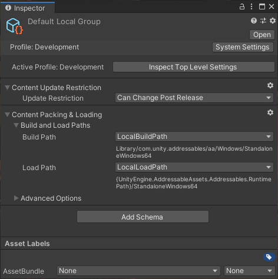
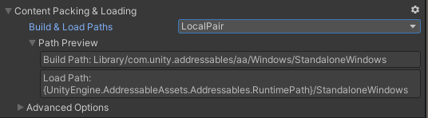
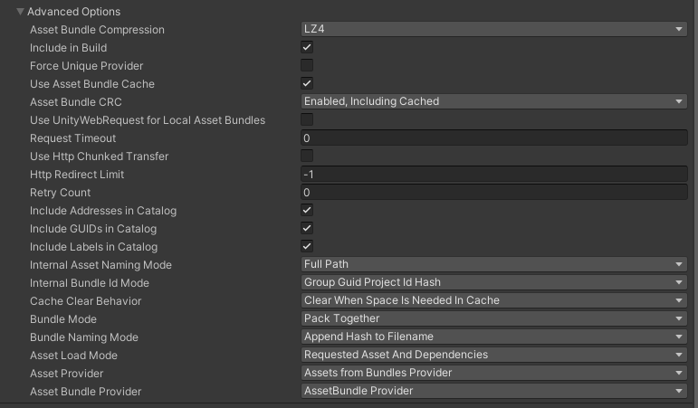

# Group settings

Group settings determine how the assets in a group are treated in content builds. For example, you can specify where  AssetBundles are built, bundle compression settings, and so on.

A group's settings are declared in [Schema] objects attached to the group. When you create a group with the __Packed Assets__ [template], the __Content Packing & Loading__ and __Content Update Restriction__ schemas define the settings for the group. These settings are expected by the default [Build scripts]. 

<br/>*The Inspector window for the Default Local Group*

> [!NOTE]
> If you create a group with the __Blank__ template, then no schemas are attached to the group. Assets in such a group cannot be processed by the default build scripts.

<a name="content-packing-loading-settings"></a>
## Content Packing & Loading settings

### Build and Load Paths

The Build and Load Paths settings of the Content Packing & Loading schema determine where the artifacts for your content builds are created and where the Addressables system should look for them at runtime.

<br/>*Building and loading paths*

| Setting| Purpose |
|:---|:---| 
| __Build & Load Paths__ | The Profile path pair that defines where the Addressables build system creates artifacts for this group and where the Addressables system loads those artifacts at runtime. Choose a path pair from the list or select `<custom>` if you want to set the build and load paths separately.|
| __Build Path__| A Profile variable that defines where the Addressables build system creates artifacts for this group. You can also set a custom string. Use one of the following for the build path:<br/>- __LocalBuildPath__: use for assets that you plan to distribute as part of your application installation.<br/>- __RemoteBuildPath__: use for assets that you plan to distribute using a remote hosting service such Unity Cloud Content Delivery or other Content Delivery Network.<br/>- __\<custom\>__: specify a string as the build path for this group.<br/></br/>Only shown if you set __Build & Load Paths__ to `<custom>`.|
| __Load Path__| A Profile variable that defines where the Addressables system loads the build artifacts for this group at runtime. You can also set a custom string. Use one of the following for the load path:<br/>- __LocalLoadPath__: use for assets that you plan to distribute as part of your application installation.<br/>- __RemoteLoadPath__: use for assets that you plan to distribute using a remote hosting service such Unity Cloud Content Delivery or other Content Delivery Network.<br/>- __\<custom\>__: specify a string as the load path for this group.<br/></br/>Only shown if you set __Build & Load Paths__ to `<custom>`.|

The build and load path options are defined by variables in your [Profiles]. Note that only variables intended for a given purpose should be used for a setting. For example, choosing a load path variable for a build path setting wouldn't give you a useful result.

When you choose a Profile variable, the current evaluation of the path is shown in the __Path Preview__. Components of the path in braces, such as `{UnityEngine.AddressableAssets.Addressable.RuntimePath}`, indicate that static variable is used to construct the final path at runtime. That portion of the path is replaced by the current value of the static variable when the Addressables system initializes at runtime.

> [!WARNING]
> In most cases, you should not change the local build or load paths from their default values. If you do, you must copy the local build artifacts from your custom build location to the project's [StreamingAssets] folder before making a Player build. Altering these paths also precludes building your Addressables as part of the Player build. 

See [Profiles] for more information.

### Advanced Options

<br/>*The Advanced Options section* 

| Setting| Purpose |
|:---|:---| 
| __Asset Bundle Compression__| The compression type for all bundles produced from the group. LZ4 is usually the most efficient option, but other options can be better in specific circumstances. See [AssetBundle Compression] for more information. |
| __Include In Build__| Whether to include assets in this group in a content build.  |
| __Force Unique Provider__| Whether Addressables uses unique instances of Resource Provider classes for this group. Enable this option if you have custom Provider implementations for the asset types in this group and instances of those Providers must not be shared between groups. |
| __Use Asset Bundle Cache__| Whether to cache remotely distributed bundles. |
| __Asset Bundle CRC__| Whether to verify a bundle's integrity before loading it.<br/>&#8226; __Disabled__: Never check bundle integrity.<br/> &#8226; __Enabled, Including Cached__: Always check bundle integrity.<br/> &#8226; __Enabled, Excluding Cached__: Check integrity of bundles when downloading.<br/> |
|__Use UnityWebRequest for Local Asset Bundles__|Load local AssetBundle archives from this group using [UnityWebRequestAssetBundle.GetAssetBundle] instead of [AssetBundle.LoadFromFileAsync]. |
| __Request Timeout__| The timeout interval for downloading remote bundles. |
| __Use Http Chunked Transfer__| Whether to use the HTTP/1.1 chunked-transfer encoding method when downloading bundles. <br/><br/> Deprecated and ignored in Unity 2019.3+. |
| __Http Redirect Limit__| The number of redirects allowed when downloading bundles. Set to -1 for no limit. |
| __Retry Count__| The number of times to retry failed downloads. |
|__Include Addresses in Catalog__|Whether to include the address strings in the catalog. If you don't load assets in the group using their address strings, you can decrease the size of the catalog by not including them.|
|__Include GUIDs in Catalog__|Whether to include GUID strings in the catalog. You must include GUID strings to access an asset with an [AssetReference]. If you don't load assets in the group using AssetReferences or GUID strings, you can decrease the size of the catalog by not including them.|
|__Include Labels in Catalog__|Whether to include label strings in the catalog. If you don't load assets in the group using labels, you can decrease the size of the catalog by not including them. |
|__Internal Asset Naming Mode__|How to name assets in the catalog internally:<br/>- __Full Path__: the assets full path in the Project<br/>- __Filename__: the asset's filename<br/>- __GUID__: the assets GUID string<br/>- __Dynamic__: the Addressables system chooses the smallest internal named based on the assets in the group|
|__Internal Bundle Id Mode__|Determines how to construct the internal Id of an AssetBundle. For example, when you set the __Group Guid__ option, Addressables creates the bundle Id by combining the group name with a bundle GUID string. |
|__Cache Clear Behavior__| Determines when an installed application clears AssetBundles from the cache.|
| __Bundle Mode__| How to pack the assets in this group into bundles:<br/>- __Pack Together__: create a single bundle containing all assets.<br/>- __Pack Separately__: create a bundle for each primary asset in the group. Subassets, such as Sprites in a Sprite sheet are packed together. Assets within a folder added to the group are also packed together. <br/>- __Pack Together by Label__: create a bundle for assets sharing the same combination of labels.  |
| __Bundle Naming Mode__| How to construct the file names of AssetBundles.|
|__Asset Load Mode__|Whether to load assets individually as you request them (the default) or always load all assets in the group together. |
| __Asset Provider__| Defines which Provider class Addressables uses to load assets from the AssetBundles generated from this group. Set this option to __Assets from Bundles Provider__ unless you have a custom Provider implementation to provide assets from an AssetBundle. |
| __Asset Bundle Provider__| Defines which Provider class Addressables uses to load AssetBundles generated from this group. Set this option to __AssetBundle Provider__ unless you have a custom Provider implementation to provide AssetBundles. |


## Content Update Restriction

The Content Update Restriction options determine how the [Check for Content Update Restrictions] tool treats assets in the group. Run this tool to prepare your groups for a differential content update build (rather than a full content build). The tool moves modified assets in any groups set to __Cannot Change Post Release__ to a new group.

The __Update Restriction__ options include:

* __Can Change Post Release__: No assets are moved by the tool. If any assets in the bundle have changed, then the entire bundle is rebuilt.
* __Cannot Change Post Release__: If any assets in the bundle have changed, then the [Check for Content Update Restrictions] tool moves them to a new group created for the update. When you make the update build, the assets in the AssetBundles created from this new group override the versions found in the existing bundles.

See [Content update builds] for more information.

## Group templates

A Group template defines which types of schema objects are created for a new group. The Addressables system includes the __Packed Assets__ template, which includes all the settings needed to build and load Addressables using the default build scripts. 

If you create your own build scripts or utilities that need additional settings you can define these settings in your own schema objects and create your own group templates:

1. Navigate to the desired location in your Assets folder using the Project panel.
2. Create a Blank Group Template (menu: __Assets > Addressables > Group Templates > Blank Group Templates__).
3. Assign a suitable name to the template.
4. In the Inspector window, add a description, if desired.
5. Click the __Add Schema__ button and choose from the list of schemas.
6. Continue adding schemas until all required schemas are added to the list.

> [!NOTE]
> If you use the default build script, a group must use the __Content Packing & Loading__ schema. If you use content update builds, a group must include the __Content Update Restrictions__ schema. See [Builds] for more information.

## Schemas

A group schema is a ScriptableObject that defines a collection of settings for an Addressables group. You can assign any number of schemas to a group. The Addressables system defines a number of schemas for its own purposes. You can also create custom schemas to support your own build scripts and utilities.

The built-in schemas include:

* __Content Packing & Loading__: this is the main Addressables schema used by the default build script and defines the settings for building and loading Addressable assets.
* __Content Update Restrictions__: defines settings for making differential updates of a previous build. See [Builds] for more information about update builds.
* __Resources and Built In Scenes__: a special-purpose schema defining settings for which types of built-in assets to display in the __Built In Data__ group. 

### Defining custom schemas

To create your own schema, extend the [AddressableAssetGroupSchema] class (which is a kind of ScriptableObject).

```csharp
using UnityEditor.AddressableAssets.Settings;

public class __CustomSchema __: AddressableAssetGroupSchema
{
   public string CustomDescription;
}
```

Once you have defined your custom schema object, you can add it to existing groups and group templates using the Add Schema buttons found on the Inspector windows of those entities.

You might also want to create a custom Editor script to help users interact with your custom settings. See [Custom Inspector scripts].

In a build script, you can access the schema settings for a group using its [AddressableAssetGroup] object.

[Addressable System Settings]: xref:addressables-asset-settings
[AddressableAssetGroup]: xref:UnityEditor.AddressableAssets.Settings.AddressableAssetGroup
[AddressableAssetGroupSchema]: xref:UnityEditor.AddressableAssets.Settings.AddressableAssetGroupSchema
[Addressables Groups window]: xref:addressables-groups#groups-window
[Addressables Settings]: xref:addressables-asset-settings
[Addressables system settings]: xref:addressables-asset-settings
[Analyze]: xref:addressables-analyze-tool
[AssetBundle Compression]: xref:AssetBundles-Cache
[AssetReference]: xref:addressables-asset-references
[Build scripts]: xref:addressables-builds#build-commands
[Builds]: xref:addressables-builds
[Content update builds]: xref:addressables-content-update-builds
[Content Workflow: Update Restrictions]: xref:addressables-content-update-builds#settings
[Custom Inspector scripts]: xref:VariablesAndTheInspector
[Default Build Script]: xref:addressables-builds
[Event Viewer]: xref:addressables-event-viewer
[Group settings]: #group-settings
[Group Templates]: #group-templates
[Group templates]: #group-templates
[Hosting]: xref:addressables-asset-hosting-services
[Labels]: xref:addressables-labels
[Loading Addressable assets]: xref:addressables-api-load-asset-async
[Organizing Addressable Assets]: xref:addressables-assets-development-cycle#organizing-addressable-assets
[Play Mode Scripts]: #play-mode-scripts
[Profile]: xref:addressables-profiles
[Profiles]: xref:addressables-profiles
[ProjectConfigData]: xref:UnityEditor.AddressableAssets.Settings.ProjectConfigData
[Schema]: #schemas
[settings of the group]: #group-settings
[template]: #group-templates
[UnityWebRequestAssetBundle.GetAssetBundle]: xref:UnityEngine.Networking.UnityWebRequest.GetAssetBundle(System.String,System.UInt32)
[AssetBundle.LoadFromFileAsync]: xref:UnityEngine.AssetBundle.LoadFromFileAsync(System.String,System.UInt32,System.UInt64)
