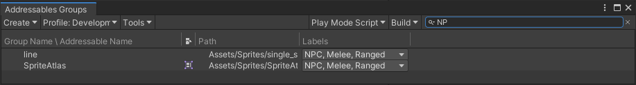
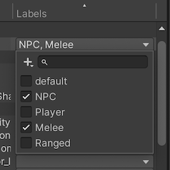
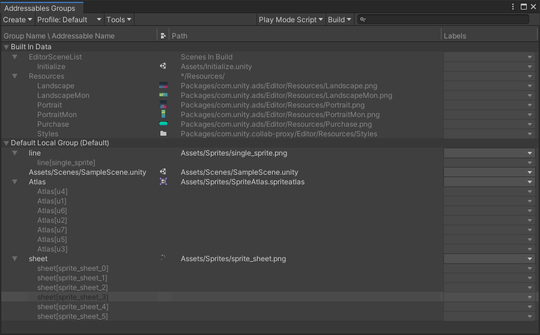
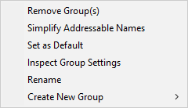
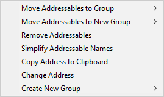
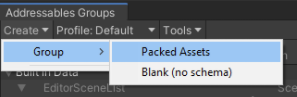
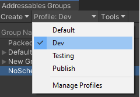
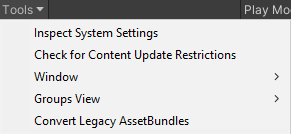
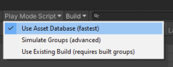
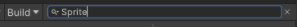

# Groups

A group is the main organizational unit of the Addressables system. Use the [Addressables Groups window] to create and manage your groups and the assets they contain.

You can organize your Addressables into groups and assign settings to each group to control how the assets are handled when you create a content build. See [Organizing Addressable Assets] for information about ways to organize your assets.

When you perform a content build, the build scripts create AssetBundles containing the assets in a group. The build determines the number of bundles to create and where to create them from both the [settings of the group] and your overall [Addressables system settings]. See [Builds] for more information.

> [!NOTE]
> Addressable Groups only exist in the Unity Editor. The Addressables runtime code does not use a group concept. However, you can assign a label to the assets in a group if you want to find and load all the assets that were part of that group. See __[Loading Addressable assets]__ for more information about selecting the assets to load using labels. 

## Managing groups

Open the Addressables Groups window (menu: __Window > Asset Management > Addressables > Groups__) to manage your groups and Addressable assets. See [Addressables Groups window] for details about the information and features of this window.

### Create a group

To create a group:

1. Open the Addressables Group window (menu: __Window > Asset Management > Addressables > Groups__).
2. Click __Create__ in the toolbar at the top of the window to open the Create menu.
3. Select __Group > Packed Asset__ to create a new group. (If you have created your own [Group Templates] they are also displayed in the menu.)
4. Select the new group and open its context menu (right- or cmd click on the name).
5. Choose __Rename__ and assign the desired name.
6. Open the context menu again and choose __Inspect Group Settings__.
7. Adjust the group settings as desired.

For groups containing assets that you plan to distribute with your main application, the default settings are a reasonable starting point. For groups containing assets that you plan to distribute remotely, you must change the build and load paths to use the remote versions of the [Profile] path variables. (To build AssetBundles for remote distribution, you must also enable the __Build Remote Catalog__ option in your [Addressable System Settings].)

See [Group settings] for more information about individual settings.

### Manage assets in a group

#### To add assets to a group

Do one of the following:

* Drag assets from the Project window to the Group window, dropping them into the desired group.
* Drag assets from one group to another.
* Check the __Addressables__ option in the asset's Inspector window to add the asset to the default group. (Use the group context menu to change which group is designated as the default.)
* Add the folder containing the assets to a group (all assets added to the folder are included in the group).

> [!NOTE]
> If you add assets in a Resources folder to a group, the Addressables system first moves the assets to a non-Resource location. You can move the assets elsewhere, but Addressable assets cannot be stored in a Resources folder in your Project.

#### To remove assets

Select one or more assets in the Groups window and choose __Remove Addressables__ from the context menu (or press the Delete key).

#### To find an asset

To locate an Addressable Asset in the Groups window type all or part of its address, path, or a label into the filter control on the Groups window toolbar. 

 *Filtering the group list by the string "NP" to find all assets labeled NPC*

To locate the asset in your project, click on it in the Groups window. Unity selects the asset in the Project window and displays the asset's Inspector.

> [!TIP]
> * To view the groups of the assets found, enable __Hierarchical Search__; disable this option to only show groups if they match the search string. Click the magnifying glass icon in the search box to enable or disable __Hierarchical Search__.
> * To view subobject addresses, such as the Sprites in a Sprite Atlas, enable the __Show Sprite and Subobject Addresses__ option using the __Tools__ menu on the Groups window toolbar.

#### To add or remove labels

Select one or more assets in the Groups window, then click on the label field for one of the selected assets.

 *Assigning labels*

To assign labels, check or uncheck the boxes for the desired labels.

Click the top left __Plus__ button, then __Manage Labels__ to add, remove, or rename your labels. Or the top left __Plus__ button, then __New Label__ to add a new label. See [Labels] for more information on how labels can be used.

## Groups window

Use the Groups window to manage your groups and Addressable assets.

The Groups window also serves as a central location for starting content builds and accessing the tools and settings of the Addressables system.

*The Addressables Groups window showing the toolbar and list of groups and assets.*

### Group list

The Group list displays the Addressable groups in your Project. Expand a group in the list to show the assets it contains. You can also expand composite assets, such as Sprite sheets, to show the subobjects they contain.

When you first install the Addressables package, the Groups window displays two groups of assets:

* __Built In Data__: contains assets in any Project Resource folders and any Scenes included in the Build Settings list. (None of these assets can be Addressable unless removed from Resources or the Scene list.)

* __Default Local Group (Default)__: Initially empty, any assets you make Addressable are added to this group. The group is set up so that its assets are built to your local build path and included in your Project builds. You can change the name, settings, and make another group the default group, if desired.

The list columns contain the following information:

| Column| Purpose |
|:---|:---| 
| __Group Name__ \ __Addressable Name__| The name of the item. For groups, this is an arbitrary name that you can assign. For assets, this is the Addressable address. You can edit the name or address using the context menu. |
| __Icon__| The Unity asset icon based on asset type. |
| __Path__| The path to the source asset in your Project. |
| __Labels__| Shows any labels assigned to the asset. Click on a Label entry to change the assigned labels or to manage your label definitions. |

You can sort the assets shown in the Group list by clicking one of the column headers. This sorts the assets within each group, but does not reorder the groups themselves. You can change the order in which your groups are displayed by dragging them into the desired position.

### Group context menu

Open the Group context menu (Right- or Cmd-click a group name) to access group-related commands:

*The Group content menu*

| Command| Action |
|:---|:---| 
| __Remove Group(s)__| Removes the Group (deleting its ScriptableObject asset). Any assets in the group revert to non-Addressable.  |
| __Simplify Addressable Names__| Shortens the name of assets in the group by removing path-like components and extensions. |
| __Set as Default__| Designates the group as the default group. When you mark an asset as Addressable without explicitly assigning a group, it is added to the default group. |
| __Inspect Group Settings__| Selects the group asset in the Unity Project window and Inspector so that you can view the settings. |
| __Rename__| Allows you to edit the name. |
| __Create New Group__| Create a new group based on a group template. |

### Asset context menu

Open the Addressable Asset context menu  (Right- or Cmd-click an asset address) to access asset-related commands:

*Addressable Asset context menu*

| Command| Action |
|:---|:---| 
| __Move Addressables to Group__| Move the selected assets to a different, existing group. |
| __Move Addressables to New Group__| Create a new group with the same settings as the current group and move the selected assets to it. |
| __Remove Addressables__| Remove the selected assets from the Group and make it non-Addressable.  |
| __Simplify Addressable Names__| Shortens the names of the selected assets by removing path-like components and extensions. |
| __Copy Address to CLipboard__| Copies the assigned address string to your system Clipboard so that you can paste it in another field. |
| __Change Address__| Allows you to edit the name. |
| __Create New Group__| Create a new group based on a group template. (Does not move the selected assets.) |

## Groups window toolbar

The toolbar at the top of the Addressables Group window provides access to the following commands and tools:

### Create
Create a group.

Choose a template for the group or Blank for no schema.

See [Group templates] for information about creating your own templates.

### Profile
Set the active Profile to determine the paths used for building and loading Addressables.

Select an existing profile or choose __Manage Profiles__ to open the Profiles window.

See [Profiles] for more information.

### Tools
Choose from a menu of settings windows and tools.

* __Inspect System Settings__: open the [Addressables Settings] Inspector.
* __Check for Content Update Restrictions__: run a pre-update content check. See [Content Workflow: Update Restrictions] for more information.
* __Window__: open other Addressables system windows:
  * __Profiles__: open the [Profiles] window.
  * __Labels__: open the [Labels] window.
  * __Analyze__: open the [Analyze] tool
  * __Hosting Services__: open the [Hosting] window.
  * __Event Viewer__: open the [Event Viewer] window.
* __Groups View__: set Group window display options: 
  * __Show Sprite and Subobject Addresses__: whether to show Sprite and subobjects in the Group list or just the parent object. 
  * __Group Hierarchy with Dashes__: when enabled, the Groups window displays groups that contain dashes '-' in their names as if the dashes represented a group hierarchy. For example, if you name two groups "x-y-z" and "x-y-w", the the window shows an entry called "x" with a child called "y", which contains two groups, called "x-y-z" and "x-y-w". Enabling this option affects the group display only.
* __Convert Legacy AssetBundles__: Assigns non-Addressable assets to Addressable groups based on their current AssetBundle settings.

### Play Mode Script 
Set the active Play Mode Script.

The active Play Mode Script determines how Addressables are loaded in the Editor Play mode. See [Play Mode Scripts] for more information.

### Build Script
Select a content build command.

* __New Build__: choose a build script to run a full content build.
* __Update a Previous Build__: run a differential update based on an earlier build.
* __Clean Build__: choose a command to clean existing build artifacts.

See [Builds] for more information.

### Filter list
Find items in the group list matching the specified string.

An item is shown if the specified string matches any part of the text in any column in the list.

> [!TIP]
> Click the magnifying glass icon to enable or disable __Hierarchical Search__, which shows results within their assigned group rather than as a flat list.

## Play Mode Scripts

The active Play Mode Script determines how the Addressable system accesses Addressable assets when you run your game in the Editor Play mode. When you select a Play Mode Script, it remains the active script until you choose a different one. The Play Mode Script has no effect on asset loading when you build and run your application outside the Editor.

The Play Mode Scripts include:

* __Use Asset Database__: loads assets directly from the Editor asset database (which is also used for all non-Addressable assets). You do not have to build your Addressable content when using this option. 
* __Simulate Groups__: analyzes content for layout and dependencies without creating AssetBundles. Loads assets from the asset database through the ResourceManager as if they were loaded through bundles. Simulates download speeds for remote AssetBundles and file loading speeds for local bundles by introducing a time delay. You can use the [Event Viewer] with this Play Mode script. See [ProjectConfigData] for configuration options.
* __Use Existing Build__: loads Assets from bundles created by an earlier content build. You must run a full build using a Build Script such as [Default Build Script] before using this option. Remote content must be hosted at the __RemoteLoadPath__ of the [Profile] used to build the content.

   
[Addressable System Settings]: xref:addressables-asset-settings
[AddressableAssetGroup]: xref:UnityEditor.AddressableAssets.Settings.AddressableAssetGroup
[AddressableAssetGroupSchema]: xref:UnityEditor.AddressableAssets.Settings.AddressableAssetGroupSchema
[Addressables Groups window]: xref:addressables-groups#groups-window
[Addressables Settings]: xref:addressables-asset-settings
[Addressables system settings]: xref:addressables-asset-settings
[Analyze]: xref:addressables-analyze-tool
[AssetBundle Compression]: xref:AssetBundles-Cache
[AssetReference]: xref:addressables-asset-references
[Build scripts]: xref:addressables-builds#build-commands
[Builds]: xref:addressables-builds
[Content update builds]: xref:addressables-content-update-builds
[Content Workflow: Update Restrictions]: xref:addressables-content-update-builds#settings
[Custom Inspector scripts]: xref:VariablesAndTheInspector
[Default Build Script]: xref:addressables-builds
[Event Viewer]: xref:addressables-event-viewer
[Group settings]: xref:addressables-group-settings#group-settings
[Group Templates]: xref:addressables-group-settings#group-templates
[Group templates]: xref:addressables-group-settings#group-templates
[Hosting]: xref:addressables-asset-hosting-services
[Labels]: xref:addressables-labels
[Loading Addressable assets]: xref:addressables-api-load-asset-async
[Organizing Addressable Assets]: xref:addressables-assets-development-cycle#organizing-addressable-assets
[Play Mode Scripts]: #play-mode-scripts
[Profile]: xref:addressables-profiles
[Profiles]: xref:addressables-profiles
[ProjectConfigData]: xref:UnityEditor.AddressableAssets.Settings.ProjectConfigData
[Schema]: xref:addressables-group-settings#schemas
[settings of the group]: xref:addressables-group-settings#group-settings
[template]: xref:addressables-group-settings#group-templates
[UnityWebRequestAssetBundle.GetAssetBundle]: xref:UnityEngine.Networking.UnityWebRequest.GetAssetBundle(System.String,System.UInt32)
[AssetBundle.LoadFromFileAsync]: xref:UnityEngine.UnityEngine.AssetBundle.LoadFromFileAsync(System.String,System.UInt32,System.UInt64)