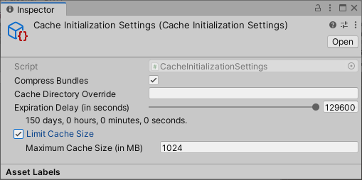
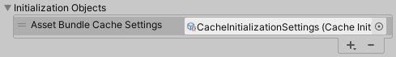

# Customizing Addressables initialization

The Addressables system initializes itself at runtime the first time you load an Addressable or make another call to an Addressable API. Call [Addressables.InitializeAsync] to initialize Addressables earlier (this function does nothing if initialization has already occurred). 

The initialization operation performs the following tasks:

* Sets up the [ResourceManager] and the [ResourceLocators].
* Loads configuration data created by Addressables from StreamingAssets.
* Executes any [initialization object] operations.
* Loads the content catalog. By default, Addressables first checks for updates to the content catalog and downloads a new catalog if available.

The following Addressables settings can change initialization behavior:

* [Disable Catalog Update on Startup]: Addressables won't automatically check for an updated catalog. See [Updating catalogs] for information about manually updating your catalogs.
* [Build Remote Catalog]: Addressables won't attempt to load remote content without a remote catalog.
* [Custom certificate handler]: identify a custom certificate handler if you need one to access your remote asset hosting service.
* [Initialization object list]: add [IObjectInitializationDataProvider] ScriptableObjects to your application that are invoked during the initialization operation.

The following runtime properties should be set before the initialization operation starts:

* [Custom URL transform function]
* [ResourceManager exception handler]
* Static properties used for any custom runtime placeholders in your [Profile variables] 

### Initialization objects

You can attach objects to the Addressable Assets settings and pass them to the initialization process at runtime. For example, you can create a [CacheInitializationSettings] object to initialize Unity's [Cache] settings at runtime. To create your own types of initialization object, create a ScriptableObject that implements the [IObjectInitializationDataProvider] interface. Use this object to create the [ObjectInitializationData] asset that Addressables includes with your the runtime data.

### Cache initialization objects

Use a [CacheInitializationSettings] object to initialize Unity's [Cache] settings at runtime.

To specify the cache initialization settings that the Addressables system should use:

1. Create the CacheInitializationSettings asset (menu: __Assets > Addressables > Initialization > Cache Initialization Settings__).
2. Select the new asset file in the Project panel to view the settings in the Inspector
   

3. Adjust the settings as desired.
4. Open the Addressables Settings Inspector (menu: __Window > Asset Management > Addressables > Settings__).
5. In the __Initialization Objects__ section of the Inspector, click the __+__ button to add a new object to the list.
6. Select your CacheInitializationSettings asset in the File dialog and click __Open__.
7. The cache settings object is added to the list.
   

When Addressables initializes at runtime, it applies these settings to the default Unity [Cache]. The settings apply to all AssetBundles in the default cache, not just those downloaded by the Addressables system. See [Caching] for more information about the Unity cache system.

> [!NOTE]
> Android applications built with Unity 202.1 or earlier or running on Android 9 or earlier can only play videos from uncompressed AssetBundles. You can use a `CacheInitializationSettings` object to disable recompression of the cache by disabling the __Compress Bundles__ option.

[Addressables.CheckForCatalogUpdates]: xref:UnityEngine.AddressableAssets.Addressables.CheckForCatalogUpdates*
[Addressables.InitializeAsync]: xref:UnityEngine.AddressableAssets.Addressables.InitializeAsync*
[Addressables.LoadContentCatalogAsync]: xref:UnityEngine.AddressableAssets.Addressables.LoadContentCatalogAsync*
[Addressables.ResourceManager]: xref:UnityEngine.AddressableAssets.Addressables.ResourceManager
[Addressables.UpdateCatalogs]: xref:UnityEngine.AddressableAssets.Addressables.UpdateCatalogs*
[Build Remote Catalog]: xref:addressables-asset-settings#catalog
[Cache]: xref:UnityEngine.Cache
[CacheInitializationSettings]: xref:UnityEditor.AddressableAssets.Settings.CacheInitializationSettings
[Caching]: xref:UnityEngine.Caching
[Catalog Download Timeout]: xref:addressables-asset-settings#downloads
[Content update builds]: xref:addressables-content-update-builds
[Custom certificate handler]: xref:addressables-asset-settings#downloads
[Custom URL transform function]: xref:addressables-api-transform-internal-id
[Customizing initialization]: #customizing-initialization
[Disable Catalog Update on Startup]: xref:addressables-asset-settings#catalog
[Getting the address of an asset at runtime]: #getting-the-address-of-an-asset-at-runtime
[initialization object list]: xref:addressables-asset-settings#initialization-object-list
[initialization object]: xref:addressables-asset-settings#initialization-object-list
[InternalId]: xref:UnityEngine.ResourceManagement.ResourceLocations.IResourceLocation.InternalId
[IObjectInitializationDataProvider]: xref:UnityEngine.ResourceManagement.Util.IObjectInitializationDataProvider
[IResourceLocation]: xref:UnityEngine.ResourceManagement.ResourceLocations.IResourceLocation
[LoadContentCatalogAsync]: xref:UnityEngine.AddressableAssets.Addressables.LoadContentCatalogAsync*
[Loading additional catalogs]: #loading-additional-catalogs
[Loading Assets by Location]: xref:addressables-api-load-asset-async#loading-assets-by-location
[Modifying resource URLs at runtime]: #modifying-resource-urls-at-runtime
[ObjectInitializationData]: xref:UnityEngine.ResourceManagement.Util.ObjectInitializationData
[PrimaryKey]: xref:UnityEngine.ResourceManagement.ResourceLocations.IResourceLocation.PrimaryKey
[Profile variable syntax]: xref:addressables-profiles#profile-variable-syntax
[Profile variables]: xref:addressables-profiles#profile-variable-syntax
[RemoteLoadPath Profile variable]: xref:addressables-profiles
[ResourceLocators]: xref:UnityEngine.AddressableAssets.ResourceLocators
[ResourceManager exception handler]: xref:UnityEngine.ResourceManagement.ResourceManager.ExceptionHandler
[ResourceManager]: xref:UnityEngine.ResourceManagement.ResourceManager
[InternalIdTransformFunc]: xref:UnityEngine.ResourceManagement.ResourceManager.InternalIdTransformFunc
[Unique Bundle Ids]: xref:addressables-content-update-builds#unique-bundle-ids-setting
[Updating catalogs]: xref:addressables-api-load-content-catalog-async#updating-catalogs