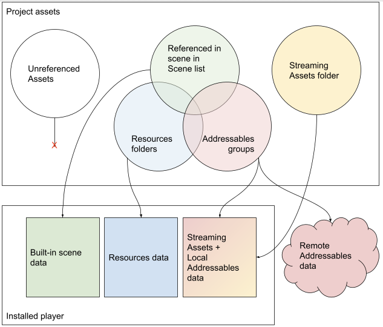
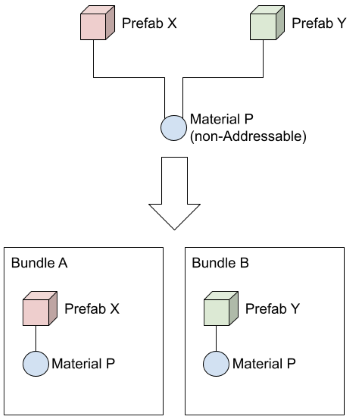

# How Addressables interact with other project assets

When you include a scene in your Project Build Settings and build a player, Unity includes that scene and any assets used in the scene in your game or application's built-in data. Similarly, Unity includes any assets found in your project's Resources folders in a separate, built-in collection of assets. (The difference is that assets in a scene are only loaded as part of a scene, whereas assets in Resources can be loaded independently.) 

Addressable assets can either be built into your game or application as an additional set of "local" assets, or kept external to the game build as "remote" assets hosted on a server and downloaded when they are needed. You can update remote assets independently from the application itself (although remote assets cannot include code, so you can only change assets and serialized data).

*How project assets are exported to a player build*

However, if you use the same asset in more than one of these categories, then Unity makes copies of the asset when building rather than sharing a single instance. For example, if you used a Material in a built-in scene and also used it in a Prefab located in a Resources folder, you would end up with two copies of that Material in your build -- even if the Material asset itself is not located in Resources. If you then marked that same Material as Addressable, you would end up with three copies. (Files in the project StreamingAssets folder can never be referenced by assets outside that folder.)

> [!NOTE]
> Before building a player, you must make a content build of your Addressable assets. During the player build, Unity copies your local Addressables to the StreamingAssets folder so that they are included in the build along with any assets you placed in StreamingAssets. (These assets are removed at the end of the build process.) It is your responsibility to upload the remote Addressables files produced by the content build to your hosting service. See [Builds] for more information.

When you use Addressables in a project, Unity recommends that you move your scenes and any data in Resources folders into Addressable groups and manage them as Addressables.

The Build Settings scene list must contain at least one scene. You can create a minimal scene that initializes your application or game. 

A small amount of data in Resources folders typically doesn't cause performance issues. If you use 3rd party packages that place assets there, you don't need to move them unless they cause problems. (Addressable assets cannot be stored in Resources folders.) 

## Shared assets in groups

When you add an asset to an Addressables group, that asset is packed into an AssetBundle when you make a content build. If an asset references other assets, known as dependencies, how those dependencies are treated depends on whether or not they are also Addressable. Dependencies that are Addressable are packed into AssetBundles according to the settings of the group they are in -- this could be the same bundle as the referencing asset or a different bundle. A dependency that is not Addressable is included in the bundle of its referencing asset. 

If more than one Addressable references the same non-Addressable asset, then copies of the non-Addressable asset are included in each bundle containing a referencing Addressable.

*Non-Addressable assets are copied to each bundle with a referencing Addressable*

A subtle consequence that can occur when an asset is implicitly included in more than one bundle, is that multiple instances of that asset can be instantiated at runtime rather than the single instance your game logic expects. If you change the instance state at runtime, only the object from the same bundle can see the change since all the other assets now have their own individual instance rather than sharing the common one. 

To eliminate this duplication, you can make the dependency an Addressable asset and include it in one of the existing bundles or add it to a different bundle. Once you make the dependency an Addressable, the bundle it is a part of is loaded whenever you load one of the Addressables that reference it.

Be aware that when you reference an asset in another bundle, then that bundle must be loaded when you load ANY asset in the current bundle, not just the asset containing the reference. Although none of the assets in this other AssetBundle are loaded, loading a bundle has its own runtime cost. See [Asset bundle dependencies] for more information. 

> [!TIP]
> Use the [Analyze tool] to identify unwanted asset duplication resulting from your project content organization.

### SpriteAtlas

Some SpriteAtlas options can change how Sprites are loaded. This is important to consider when using the **Use Asset Database** [Play Mode Script].
* [Sprite Packer Mode] 
* SpriteAtlas [Include In Build]

Additionally Addressables handles SpriteAtlases a bit differently than other assets, as illustrated by the following examples:

#### Addressable Sprites 

__Example 1:__

Three textures exist and are marked as Addressable in three separate groups. Each texture builds to about 500KB. During the build, they are built into three separate AssetBundles, each AssetBundle only containing the given sprite metadata and texture. Each AssetBundle is about 500KB and none of these AssetBundles have dependencies.

__Example 2:__

The three textures in Example 1 are put into a SpriteAtlas. That atlas is not Addressable. One of the AssetBundles generated contains that atlas texture and is about 1500KB. The other two AssetBundles only contain Sprite metadata (a few KB), and list the atlas AssetBundle as a dependency. Which AssetBundle contains the texture is deterministic in that it is the same through rebuilds, but is not something that can be set by the user. This is the key portion that goes against the standard duplication of dependencies. The sprites are dependent on the SpriteAtlas texture to load, and yet that texture is not built into all three AssetBundles, but is instead built only into one.

__Example 3:__

The SpriteAtlas from Example 2 is marked as Addressable in its own AssetBundle. At this point there are four AssetBundles created. If you are using a 2020.x or newer version of Unity, this builds as you would expect. The three AssetBundles with the sprites are each only a few KB and have a dependency on this fourth SpriteAtlas AssetBundle, which is about 1500KB. If you are using 2019.x or older, the texture itself may end up elsewhere. The three Sprite AssetBundles still depend on the SpriteAtlas AssetBundle. However, the SpriteAtlas AssetBundle may only contain metadata, and the texture may be in one of the other Sprite AssetBundles.

#### Addressable Prefabs With Sprite dependencies 

__Example 1:__

Instead of three Addressable textures, there are three Addressable sprite prefabs. Each prefab depends on its own sprite (about 500KB). Building the three prefabs separately results, as expected, in three AssetBundles of about 500KB each.

__Example 2:__

Taking the prefabs and textures from the previous example, all three textures are added to a SpriteAtlas, and that atlas is not marked as Addressable. In this scenario, the SpriteAtlas texture is duplicated. All three AssetBundles are approximately 1500KB. This is expected based on the general rules about duplication of dependencies, but goes against the behavior seen in "Addressable Sprite Example 2".

__Example 3:__

Taking the prefabs, textures, and SpriteAtlas from the above example, the SpriteAtlas is also marked as Addressable. Conforming to the rules of explicit inclusion, the SpriteAtlas texture is included only in the AssetBundle containing the SpriteAtlas. The AssetBundles with prefabs reference this fourth AssetBundle as a dependency.

[Analyze tool]: xref:addressables-analyze-tool
[Asset bundle dependencies]: xref:addressables-memory-management#assetbundle-dependencies
[Builds]: xref:addressables-builds
[Include In Build]: https://docs.unity3d.com/Manual/SpriteAtlasDistribution.html#Dontinclbuild
[Play Mode Script]: xref:addressables-groups#play-mode-scripts
[Sprite Packer Mode]: https://docs.unity3d.com/Manual/SpritePackerModes.html