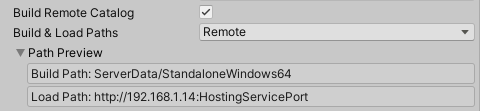
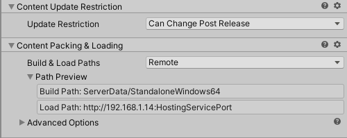
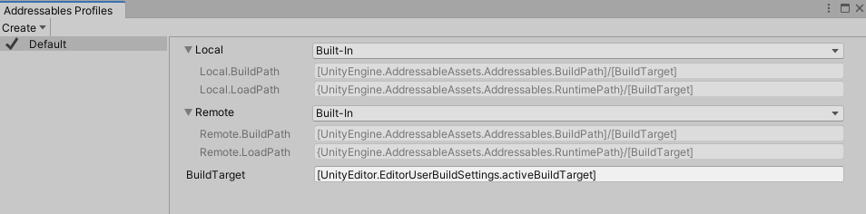
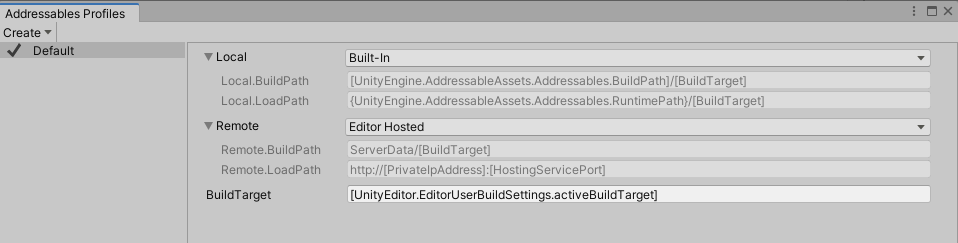
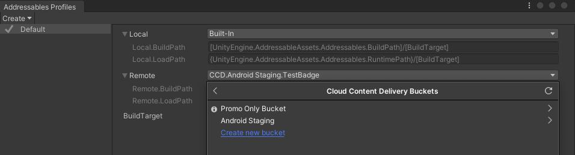

# Remote content distribution

Distributing content remotely can reduce initial app download size and install time. You can also update remotely distributed assets without republishing your app or game

When you assign a remote URL as the Load Path of a group, the Addressables system loads assets in the group from that URL. When you enable the Build Remote Catalog option, Addressables looks up the addresses of any remote assets in the remote catalog, allowing you to make changes to Addressable assets without forcing users to update and reinstall the entire game or application.

After [enabling remote distribution], you can build your content in two ways:

* A full [content build] using the __New Build > Default Build Script__: builds all content bundles and catalogs. Always perform a full build before rebuilding your player when preparing to publish or update your full application.
* A [content update build] using the __Update a Previous Build__ script: builds all content bundles and catalogs, but sets up the remote catalog so that installed applications only need to download the changed bundles. Run the __[Check for Content Update Restrictions]__ tool to identify changes and prepare your groups before building an update.

After building a full build or an update, you must upload your remote catalog, catalog hash file, and remote bundles to your hosting service.

See [Using Profiles to aid development] for tips on setting up Addressables Profiles to help you develop, test, and publish remote content.

## Enabling remote distribution

To enable remote distribution of your content, you must enable the remote catalog and set up the groups containing the assets you want to host remotely.  

### Enabling the remote catalog

Enable the remote catalog in your __Addressable Asset Settings__ Inspector (menu: __Window > Asset Management > Addressables > Settings__).

* __Build Remote Catalog__: enabled
* __Build & Load Paths__: Remote

 *Enabling the remote catalog*

 The catalog and its accompanying hash file are built to the folder specified by the __Build Path__ setting. You must upload these files so that they can be accessed at the URL specified by your __Load Path__ setting. Unless you have a specific reason not to, use the __Remote__ location so that the catalog is built to and loaded from the same paths as your remote bundles.

### Setting up a remote group

To set up a group so that the assets in it can be hosted remotely, set the __Build & Load Paths__ using the __Remote__ location:

If you plan to publish content updates between publishing full rebuilds of your application, set the __Update Restriction__ value according to how often you expect to update content in a group.

Choose __Cannot Change Post Release__ for groups that produce larger bundles, especially if you do not anticipate changing most of the assets in the group. If you do change assets in a group with this setting, the Addressables tools move the changed assets to a new group for the update. Only the new bundles are downloaded by installed applications.

Choose __Can Change Post Release__ for groups containing assets that you expect to change frequently. If you change assets in a group with this setting, the bundles containing those assets are rebuilt as a whole and will be redownloaded by installed applications. To reduce the amount of data that needs to be downloaded after an update, try to keep the bundles produced by groups with this setting as small as possible.

See [Content update builds] for more information about updating remote content.

The __Advanced Options__ section contains some options that affect remote hosting and downloads (but aren't necessary to enable remote hosting). See [Advanced Options] for more information.

## Using Profiles to aid development

A [Profile] defines variables that you can use to set the build and load paths for both your local and remote content. 

When you distribute content remotely, you typically need to set different URLS (load paths) for your remote content depending on why you are making a build. Some examples of such situations include:

__Builds for testing general game play and function__

Early in development or when you need to test without access to a host, you might find it convenient to treat all your content as local content. For this situation set the __Local__ and __Remote__ profile variables using the __Built-In__ location. 

*All content treated as local*

__Builds for local hosting__

Later, when you set up a host on your local network (or localhost), you will need to change the Load Path for your remote groups to reflect the URL of the host. For example if using [Editor Hosting], set the __Remote__ profile variable using the __Editor Hosting__ location.

*Remote content served from Editor Hosting*

__Builds for CDN__

As you get closer to production, you might use a staging server and then, your production Content Delivery Network (CDN). For example if using [Cloud Content Delivery], set the __Remote__ profile variable using the __Cloud Content Delivery__ location.

  
*Remote content hosted on the Unity Cloud Content Delivery service*

__Other__

Even after release, you might want to use different host URLs for beta testing or other purposes.  

Rather than hand configuring the build and load paths every time you build, you can create a different Profile and set the variables appropriately. Then, you can easily switch between Profiles before making a content build without worrying about misconfiguring the paths.

If you use a script to launch your content builds, then you can use the Addressables API to choose a specific Profile for a build. See [Starting an Addressables build from a script].

If you have complex URLs, you can reference static fields or properties in your Profile variables that are evaluated at build- or runtime. For example, rather than entering your CCD ProjectID as a string, you could create an Editor class that provides the information as a static property and reference it as, [CCDInfo.ProjectID]. See [Profile variable syntax] for more information. ([InternalIdTransformFunc] functions provide an additional method of handling complex URL requirements.)

> [!NOTE]
> If your remote URL requires cannot be expressed as a static string see [Custom URL evaluation] for information about how you can rewrite the URL for assets, including AssetBundles, at runtime.

## AssetBundle caching

By default, AssetBundles produced for an Addressables build are cached on the client device after they are downloaded. Cached bundles are only downloaded again if they are updated or if they are deleted from the cache. 

An updated catalog can exclude bundle entries present in an older version of the catalog. When these entries are cached, their data is no longer needed on the device.

When you have unneeded cache data on the device, you can choose one of three options:
* To delete the entire bundle cache, use [Caching.ClearCache].
* To remove cache entries that are no longer referenced at any time, use [Addressables.CleanBundleCache]. You usually call this function after initializing Addressables (see [Customizing Addressables initialization]) or after loading additional catalogs (see [Managing catalogs at runtime]).
* To automatically call [Addressables.CleanBundleCache] after updating catalogs, use the parameter `autoCleanBundleCache` in [Addressables.UpdateCatalogs]. See [Checking for content updates at runtime] for an example script.

If you disable caching for a group, the remote bundles produced for the group are stored in memory when they are downloaded until you unload them or the application exits. The next time the application loads the bundle, Addressables downloads it again.

You can control whether the bundles produced by a group are cached or not with the __Use Asset Bundle Cache__ setting under [Advanced Options] in the Group Inspector.

See [AssetBundle compression] for additional information about AssetBundle caching. The Addressables system sets the cache-related parameters of the [UnityWebRequests] it uses to download Addressable bundles based on the group settings.

Note that there are some limitations for WebGL AssetBundles. For more information, see [Building and running a WebGL project].

## Pre-downloading remote content

In situations where you want to predownload content so that it is cached on disk and faster to access when the application needs it, you can use the [Addressables.DownloadDependenciesAsync]  method. This method downloads an Addressable entity and any dependencies as a background task.

Calling the [Addressables.DownloadDependenciesAsync] method loads the dependencies for the address or label that you pass in. Typically, this is the AssetBundle.

The [AsyncOperationHandle] struct returned by this call includes a PercentComplete attribute that you can use to monitor and display download progress. You can also have the app wait until the content has loaded.

### Regarding PercentComplete

PercentComplete takes into account several aspects of the underlying operations being handled by a single AsyncOperationHandle. There may be instances where the progression isn't linear, or some semblance of linear. This can be due to quick operations being weighted the same as operations that will take longer.

For example, given an asset you wish to load from a remote location that takes a non-trivial amount of time to download and is reliant on a local bundle as a dependency you'll see your PercentComplete jump to 50% before continuing. This is because the local bundle is able to be loaded much quicker than the remote bundle. However, all the system is aware of is the need for two operations to be complete.

If you wish to ask the user for consent prior to download, use [Addressables.GetDownloadSize] to return how much space is needed to download the content from a given address or label. Note that this takes into account any previously downloaded bundles that are still in Unity's AssetBundle cache.

While it can be advantageous to download assets for your app in advance, there are instances where you might choose not to do so. For example:

* If your app has a large amount of online content, and you generally expect users to only ever interact with a portion of it.
* You have an app that must be connected online to function. If all your app's content is in small bundles, you might choose to download content as needed.

Rather than using the percent complete value to wait until the content is loaded, you can use the preload functionality to show that the download has started, then continue on. This implementation would require a loading or waiting screen to handle instances where the asset has not finished loading by the time it's needed.

## Custom URL evaluation

There are several scenarios where you might need to customize the path or URL of an Asset (an AssetBundle generally) at runtime. The most common example is creating signed URLs. Another is dynamic host determination.

See [ID transform function] for more information.

## Content catalogs

Content Catalogs are the data stores Addressables uses to look up an asset's physical location based on the key(s) provided to the system. By default, Addressables builds a single catalog for all Addressable assets. The catalog is placed in the StreamingAsset folder when you build your application player. The local catalog can access remote as well as local assets, but if you want to update content between full builds of your application, you must also enable the [Build Remote Catalogs] option.

The remote catalog is a separate copy of the catalog that you host along with your remote content. Ultimately, Addressables only uses one of these catalogs. If a remote catalog is built and it has a different hash than the local catalog, it is downloaded, cached, and used in place of the built-in local catalog. When you produce a [content update build], the hash is updated and the new remote catalog points to the changed versions of any updated assets.

> [!NOTE]
> You must enable the remote catalog for the full player build that you publish. Otherwise, the Addressables system does not check for a remote catalog and thus cannot detect any content updates. See [Enabling the remote catalog]. 

## Loading additional catalogs

It is possible, however, to specify additional Content Catalogs to be loaded. There are different reasons you might decide loading additional catalogs is right for your project, such as building an art-only project that you want to use across different projects.

Should you find that loading additional catalogs is right for you, there is a method that can assist in this regard, LoadContentCatalogAsync.

For LoadContentCatalogAsync, all that is required is for you to supply the location of the catalog you wish to load. However, this alone does not use catalog caching, so be careful if you're loading a catalog from a remote location. You will incur that WebRequest every time you need to load that catalog.

To help prevent you from needing to download a remote catalog every time, if you provide a .hash file with the hash of the catalog alongside the catalog you're loading, we can use this to properly cache your Content Catalog. 

> [!NOTE]
> * The hash file does need to be in the same location and have the same name as your catalog. The only difference to the path should be the extension.
> * You'll notice this method comes with a parameter autoReleaseHandle. In order for the system to download a new remote catalog, any prior calls to LoadContentCatalogAsync that point to the catalog you're attempting to load need to be released. Otherwise, the system picks up the Content Catalog load operation from our operation cache. If the cached operation is picked up, the new remote catalog is not downloaded. If set to true, the parameter autoReleaseHandle can ensure that the operation doesn't stick around in our operation cache after completing.

[Addressables.CleanBundleCache]: xref:UnityEngine.AddressableAssets.Addressables.CleanBundleCache*
[Addressables.DownloadDependenciesAsync]: xref:UnityEngine.AddressableAssets.Addressables.DownloadDependenciesAsync*
[Addressables.GetDownloadSize]: xref:UnityEngine.AddressableAssets.Addressables.GetDownloadSize*
[Addressables.UpdateCatalogs]: xref:UnityEngine.AddressableAssets.Addressables.UpdateCatalogs(System.Boolean,System.Collections.Generic.IEnumerable{System.String},System.Boolean)
[Advanced Options]: xref:addressables-group-settings#advanced-options
[AssetBundle compression]: xref:AssetBundles-Cache
[AsyncOperationHandle]: xref:UnityEngine.ResourceManagement.AsyncOperations.AsyncOperationHandle
[Build Remote Catalogs]: xref:addressables-asset-settings#catalog
[Building and running a WebGL project]: xref:webgl-building#AssetBundles
[CacheInitializationSettings]: xref:UnityEditor.AddressableAssets.Settings.CacheInitializationSettings
[Caching.ClearCache]: xref:UnityEngine.Caching.ClearCache
[Checking for content updates at runtime]: xref:addressables-content-update-builds#checking-for-content-updates-at-runtime
[Cloud Content Delivery]: xref:addressables-ccd
[content build]: xref:addressables-builds
[content update build]: xref:addressables-content-update-builds
[Content update builds]: xref:addressables-content-update-builds
[Customizing Addressables initialization]: xref:addressables-api-initialize-async
[Custom URL evaluation]: xref:addressables-api-transform-internal-id
[Editor Hosting]: xref:addressables-asset-hosting-services
[enabling remote distribution]: #enabling-remote-distribution
[Enabling the remote catalog]: #enabling-the-remote-catalog
[Managing catalogs at runtime]: xref:addressables-api-load-content-catalog-async
[Profile variable syntax]: xref:addressables-profiles#profile-variable-syntax
[Profile]: xref:addressables-profiles
[Starting an Addressables build from a script]: xref:addressables-api-build-player-content#starting-an-addressables-build-from-a-script
[Using Profiles to aid development]: #using-profiles-to-aid-development
[Check for Content Update Restrictions]: xref:addressables-content-update-builds#check-for-content-update-restrictions-tool
[InternalIdTransformFunc]: xref:addressables-api-transform-internal-id
[AddressableAssetSettings]: xref:addressables-asset-settings
[UnityWebRequests]: xref:UnityEngine.Networking.UnityWebRequest
[ID transform function]: xref:addressables-api-transform-internal-id