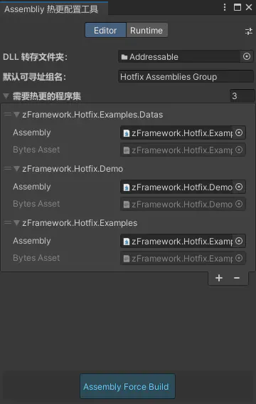
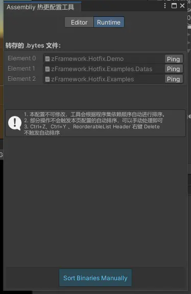
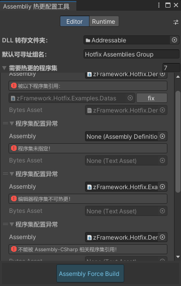
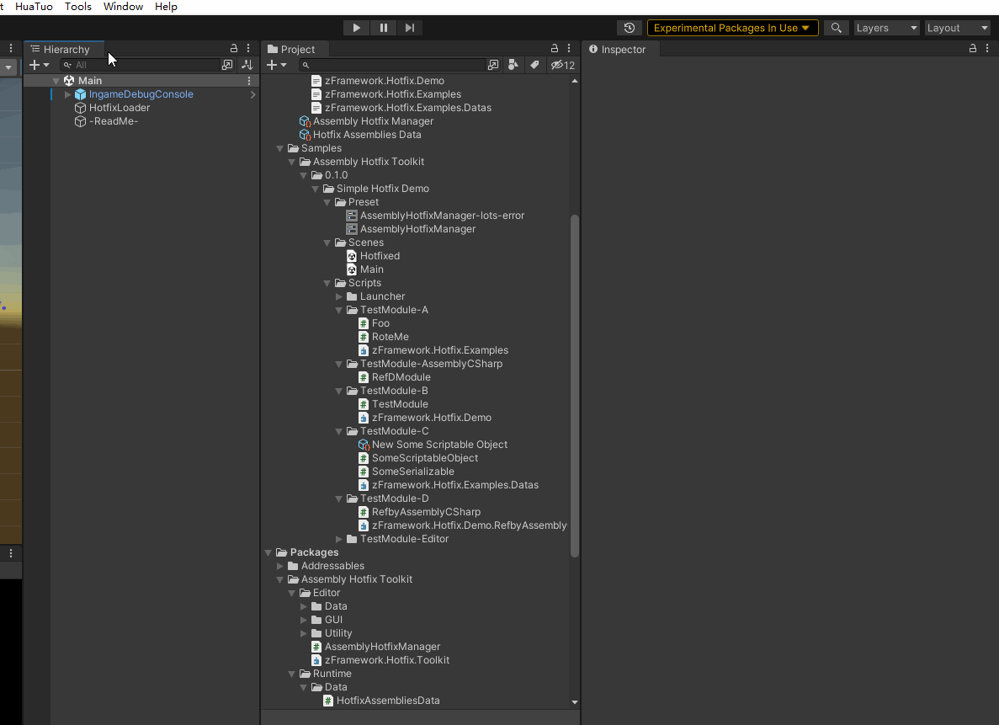
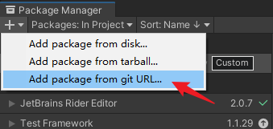

# Assemblies-Hotfix-Toolkit-Unity

这个工具为实现基于 Addressables 的无感知逻辑热更而作！
本工具实现对用户指定的需要热更的程序集实施校验、转存以及打包过滤。
有了本工具，留给用户只的操作只剩下：
1. 拖入程序集
2. 解决校验出来的错误
3. 首次 force build 程序集

# 预览

|Editor|Rumtime|Some Errors|
|:-:|:-:|:-:|
||||
|热更程序集配置页面 | 运行时加载顺序排序与预览|编辑器下一些常见错误预览|

# 功能
下面简要的说明本工具功能：
1. 对指定的热更程序集进行校验:
 
      a. 引用框为空则警示
  
      b. 识别编辑器程序集并警示
    
      c. 识别被默认程序集引用并警示（默认程序集：Assembly-CSharp.dll，Assembly-CSharp-firstpass.dll）
  
      d. 如果热更程序集被引用，则展示被引用的程序集并提示需要修复
  
2. 热更程序集在 Addressables 打包时自动转存为 .bytes 文件并打包到 ab 中
3. 将 .bytes 文件及其配置文件 自动加入 Addressables Group
4. 对加载的程序集自动进行拓扑排序，保证程序集按正确的引用顺序加载

# 演示
> Editor 工作流演示
 

# 安装

通过 git 链接安装：
将url `https://github.com/Bian-Sh/Assemblies-Hotfix-Toolkit-Unity.git?path=Packages/com.bshsf.hotfix-toolkit` 拷贝并添加到 Package Manager

> 支持 Unity 版本：Unity 2020 及以上.
> 
> 国内用户使用需要一些技巧，或者多试几次。

# 使用
1. 本工具依赖 Addressable，使用前请初始化 Addressables
2. scripting backend ： mono 默认支持逻辑热更，适用于 PC 和 安卓
3. scripting backend ： il2cpp 请先安装 huatuo 以支持全平台的逻辑热更。
4. 拿本项目测试的同学请先清除 aa 相关缓存。
5. 具体使用流程是：
> 对需要热更的模块添加 assembly definition file  
> 
> 👉 拖入此 .asmdef（assembly definition file）文件到本工具 Editor 页面 
> 
> 👉 解决可能出现的异常 
> 
> 👉 新增 .asmdef 文件后需要点击下方“Assembly Force Build”按钮
> 
> 👉 其余为工具自动操作：打 AA（Addressabls）自动转存 .bytes 文件，打app 自动剔除热更逻辑
> 
6. 友情提示：

    a. il2cpp 逻辑热更需要深度学习一下相关的限制及应对措施(主要围绕类型裁剪)！
    
    b. mono 逻辑热更，Serializable Type 即便通过 inspector 赋值了，也无法在 ab 中正常使用，[👉 更多](https://forum.unity.com/threads/advanced-use-case-assetbundles-and-dynamically-loaded-assemblies.737183/)

